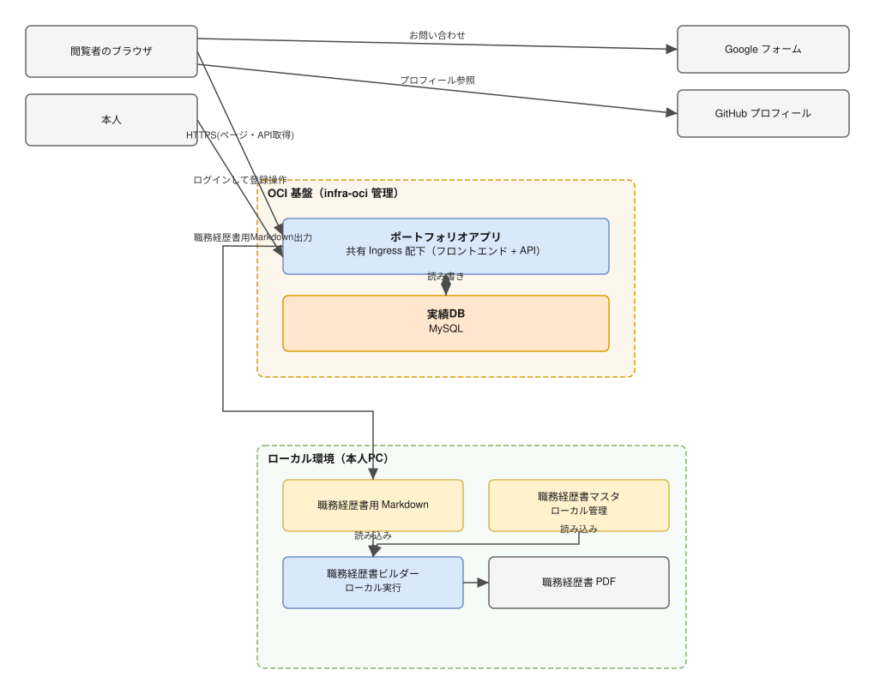
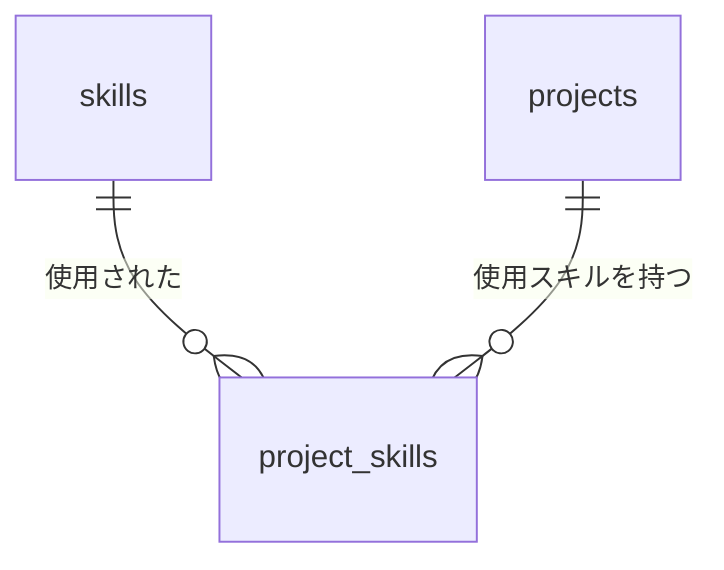
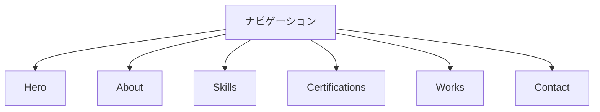
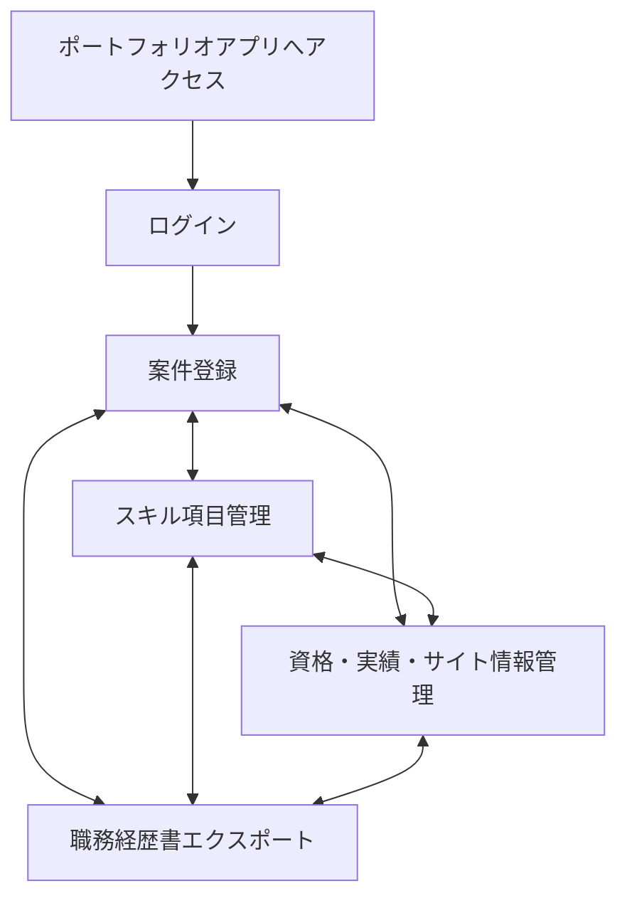
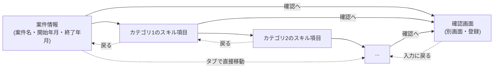

# 基本設計書 - Portfolio サイト / スキル実績管理

## 1. システム構成

### 1.1. 前提インフラ

- OCI 基盤（infra-oci リポジトリが管理する Kubernetes クラスタ・MySQL・共有 Ingress）。
  基盤自体の構築・運用は infra-oci リポジトリの責務であり、本リポジトリはその上で動作する
  ポートフォリオアプリ（コンテナイメージ・アプリケーションコード）のみを管理する。
  ポートフォリオサイト（フロントエンド）のホスティングもこのポートフォリオアプリに含める
  （GitHub Pages は用いない）

### 1.2. 構成図

[別紙: システム構成図](99.appendix/別紙_システム構成図.drawio.svg)



閲覧者のブラウザは、ポートフォリオサイトのページ・表示データ（スキル・資格・実績）のいずれも
同一のポートフォリオアプリから取得する。ページ本体とデータ取得用 API が同一オリジンとなるため、
クロスオリジン通信の制御は発生しない。案件情報を含む登録操作は本人のログインを要する画面からのみ行う。

ポートフォリオアプリ・実績 DB の実体（Kubernetes・MySQL）は infra-oci リポジトリが管理する OCI 基盤上に
配置する。本リポジトリはアプリケーションのソースコード・コンテナイメージ定義・Kubernetes
マニフェスト（Deployment・Service）を管理し、基盤自体のリソース定義は持たない。

## 2. 技術スタック

### 2.1. バージョン確定方針

- 外部ライブラリは最小限に留め、CDN 経由でバージョンを固定して読み込む
- ポートフォリオアプリは、infra-oci 基盤上の既存アプリ（kakeibo）と技術スタックを揃え、
  基盤側の運用手順（コンテナビルド・Kubernetes マニフェストの様式）を再利用する

### 2.2. 採用ライブラリ

| ライブラリ | バージョン | 用途 | 配信元 |
| ---------- | ---------- | ---- | ------ |
| Font Awesome | 6.4.0 | アイコン表示 | cdnjs.cloudflare.com |
| Google Fonts (Inter) | 400 / 500 / 700 / 800 | 本文フォント | fonts.googleapis.com |

ポートフォリオアプリ（`webapp/`）の言語・フレームワーク・バージョンは
[`webapp/README.md`](../../webapp/README.md) を正とする。

## 3. 機能設計

| 機能 | 実現方式 |
| ---- | -------- |
| ナビゲーション | アンカーリンク + CSS によるスムーズスクロール。`js/main.js` でモバイル用ハンバーガーメニューの開閉を制御する |
| Hero タイピングアニメーション | `js/main.js` が肩書き文字列配列を 1 文字ずつ `#typing-text` に追加・削除してループ再生する |
| サイト情報の表示 | ポートフォリオアプリの読み取り専用 API（[6.2](#62-ポートフォリオ用読み取り専用api)）を `fetch` で呼び出し、`js/main.js` が Hero（氏名・肩書き・キャッチコピー）、About（自己紹介文・年齢・職業・学歴・居住地・趣味・GitHub URL）、Contact（案内文・問い合わせフォーム URL・GitHub URL）、フッター（氏名・著作権表示の年）を描画する。年齢は API が生年月日から算出して返し、著作権表示の年は API 呼び出し時点の年を返す |
| Skills スキルバー | ポートフォリオアプリの読み取り専用 API（[6.2](#62-ポートフォリオ用読み取り専用api)）を `fetch` で呼び出し、カテゴリ別にグルーピングして描画する |
| 経験年数の算出 | 実績 DB の案件実績（開始年月・終了年月・使用スキル）を年月に展開し、スキルごとにユニーク月数を集計して N年Mヶ月 に換算する（[4.9](#49-経験年数の算出)） |
| 案件期間の導出 | 案件実績が保持する開始年月・終了年月をそのまま用いる（[4.10](#410-案件期間の導出)） |
| ポートフォリオ用データ提供 | 集計結果を API のレスポンスとして返す（[6.2](#62-ポートフォリオ用読み取り専用api)） |
| 職務経歴書用データ出力 | 集計結果を `■テクニカルスキル` 表と `■開発経歴` の案件期間の Markdown として出力する（[6.3](#63-職務経歴書用データmarkdown)） |
| アクセス制御 | 登録・変更操作は本人のログインを要する画面からのみ実行できる（[6.4](#64-ポートフォリオアプリ)） |
| 案件実績登録 | 案件の開始年月・終了年月（継続中の場合は未設定）とスキル項目のチェック状態を、その案件の実績として登録・更新する（[5.3.2](#532-スキル実績管理ポートフォリオアプリ)） |
| 直近案件の初期表示 | 登録画面の初期状態として、直近案件（終了年月が未設定の案件。なければ終了年月が最も新しい案件）の登録内容を表示する（[5.3.2](#532-スキル実績管理ポートフォリオアプリ)） |
| スキル項目のページ送り登録 | 案件登録画面のスキル項目チェックを `category` 単位のページへ分割し、次のカテゴリへ進める形式で表示する。パブリッククラウドの各提供元（AWS・Azure・OCI 等）も `category` の一つとして同じ仕組みでページ分割される（[5.3.2](#532-スキル実績管理ポートフォリオアプリ)） |
| スキル項目の管理 | マスタ（`skills`）の追加・変更・削除を画面から行う。実績が紐づく項目は削除できない（[5.3.2](#532-スキル実績管理ポートフォリオアプリ)） |
| Certifications 資格一覧 | ポートフォリオアプリの読み取り専用 API（[6.2](#62-ポートフォリオ用読み取り専用api)）を `fetch` で呼び出し、`js/main.js` が `#certifications-container` に描画する |
| Works 実績カード | ポートフォリオアプリの読み取り専用 API（[6.2](#62-ポートフォリオ用読み取り専用api)、`title` / `desc_ja` / リンク等）を `fetch` で呼び出し、`js/main.js` が `#works-container` に描画する |
| 資格・実績の管理 | ポートフォリオアプリの登録画面から資格（`certifications`）・実績（`works`）の追加・変更・削除を行う（[5.3.2](#532-スキル実績管理ポートフォリオアプリ)） |
| Contact | 静的な Google フォーム URL・GitHub プロフィール URL へのリンク（サイト内フォーム処理は持たない） |
| 表示文言の切り出し | `js/i18n.js` に `data-i18n` 属性と対応する文言を保持する。`currentLang` は `'ja'` に固定しており、言語切替 UI・英語リソースは持たない |

## 4. データ設計

### 4.1. 共通方針

- スキル・案件・使用実績・資格・実績の蓄積先は、infra-oci 基盤の MySQL 上に配置する実績 DB とする
- 実績 DB は本リポジトリでは管理しない（テーブル定義・マイグレーションは `webapp/` 配下のアプリケーション
  コードで管理し、データベース自体のプロビジョニングは infra-oci リポジトリの責務とする）
- 各テーブルの列名は半角英小文字のスネークケースとする
- 年月は `YYYY-MM` 形式の文字列で保持する
- 継続中の案件は終了年月を空文字列（または NULL）とし、未確定の状態を表す
- 実績の有無はレコードの有無で表す。有効・無効を示すフラグ列を持たない
- 集計値（経験年数・ユニーク月数）はテーブルに保持せず、API 呼び出し時に都度算出する。
  実績と集計値が二重管理になることを避けるため
- スキーマの追加・変更はアプリケーションのマイグレーションで管理し、
  手作業によるテーブル操作を行わない

### 4.2. テーブル構成

| テーブル名 | 役割 | キー |
| ---------- | ---- | ---- |
| `skills` | スキル項目マスタ | `skill_id` |
| `projects` | 案件実績（期間） | `project_id` |
| `project_skills` | 案件ごとの使用スキル実績 | `project_id` + `skill_id` |
| `certifications` | 資格 | `certification_id` |
| `works` | 実績（Works） | `work_id` |
| `site_info` | サイト全体の表示情報（Hero・About・Contact・フッター。1 行のみ） | `site_info_id` |



案件が期間（開始年月・終了年月）を保持し、案件ごとの使用スキルを `project_skills` に記録する。
登録操作を「対象案件の期間を入力し、使用したスキル項目をチェックする」1 セットに収めるためであり、
経験年数・案件期間・両出力に必要な情報はこの構成で充足する。

`certifications`・`works`・`site_info` は `skills`・`projects` と参照関係を持たない独立したテーブルとし、
ポートフォリオサイトへの表示のみを目的とする。

### 4.3. `skills`（スキル項目マスタ）

| 列名 | 型 | 必須 | 内容 |
| ---- | -- | ---- | ---- |
| `skill_id` | 文字列 | ○ | スキル項目の識別子。半角英小文字・数字・ハイフンで構成し、登録後は変更しない |
| `category` | 文字列 | ○ | 種類。ポートフォリオのカテゴリ見出し、職務経歴書の「種類」列、案件登録画面のページ単位に対応する |
| `subcategory` | 文字列 | - | サブカテゴリ。項目数の多い `category`（AWS 等）を案件登録画面でサブタブに分けるための区分。空文字の場合は区分しない。ポートフォリオ・職務経歴書には表示しない |
| `name` | 文字列 | ○ | 表示名。ポートフォリオ・職務経歴書に共通で使用する |
| `sort_order` | 整数 | ○ | 同一 `category` 内での表示順 |

ポートフォリオと職務経歴書で異なるスキル項目一覧を持たない。両者の出力対象は本テーブルに一本化する。

パブリッククラウドは、クラウドサービス提供元（AWS・Azure・OCI 等）を `category` とし、
提供元が持つサービス（EC2・VPC・RDS 等）を `name` に持つスキル項目として、他のスキル項目と
同様に本テーブルへ登録する。「パブリッククラウド」という単一の `category` や、クラウド名を
`name` とするスキル項目は持たない。クラウドの提供元単位で経験年数を管理する上位項目は
設けず、サービス単位の項目のみを管理する。
AWS のように項目数が多い提供元は、`subcategory` に AWS 公式のサービスカテゴリ（Compute・
Networking & Content Delivery 等）を設定して区分する。

### 4.4. `projects`（案件実績）

| 列名 | 型 | 必須 | 内容 |
| ---- | -- | ---- | ---- |
| `project_id` | 文字列 | ○ | 案件の識別子。案件登録画面では入力させず、サーバー側で自動採番する。登録後は変更しない |
| `name` | 文字列 | ○ | 案件名。職務経歴書マスタの `■開発経歴` に記載する案件名と一致させる |
| `start_year_month` | 文字列 | ○ | 開始年月（`YYYY-MM`） |
| `end_year_month` | 文字列 | - | 終了年月（`YYYY-MM`）。空値の場合は継続中を表す |

案件は期間（`start_year_month`）から表示順が一意に定まるため、スキル項目マスタと異なり
`sort_order` 列は持たない。出力時の案件の並び順は [6.3](#63-職務経歴書用データmarkdown) に従う。

`name` は、出力した期間を職務経歴書マスタのどの案件に対応させるかを判定するキーとなるため、
職務経歴書マスタ側の表記と一致させる。

案件の削除は、紐づく `project_skills` の実績も同時に削除する。経験年数の算出結果に影響するため、
削除前に画面上で確認を求める（[5.3.2](#532-スキル実績管理ポートフォリオアプリ)）。

### 4.5. `project_skills`（案件ごとの使用スキル実績）

| 列名 | 型 | 必須 | 内容 |
| ---- | -- | ---- | ---- |
| `project_id` | 文字列 | ○ | `projects` の `project_id` を参照する |
| `skill_id` | 文字列 | ○ | `skills` の `skill_id` を参照する |
| `version` | 文字列 | - | その案件でそのスキル項目を使用した際のバージョン（例: `3.14`、`X 5.3`）。バージョンの概念がない項目や、特定しない場合は空文字列とする |

- 1 行が「ある案件であるスキル項目を使用した」1 件の実績を表す縦持ち形式とする
- `project_id` と `skill_id` の組み合わせは一意とし、重複して登録しない
- `version` はスキル項目マスタ（`skills`）ではなく案件ごとの実績側で保持する。同一のスキル項目でも
  案件によって使用したバージョンが異なりうるため

### 4.6. `certifications`（資格）

| 列名 | 型 | 必須 | 内容 |
| ---- | -- | ---- | ---- |
| `certification_id` | 整数 | ○ | 資格の識別子。サーバー側で自動採番する |
| `name` | 文字列 | ○ | 資格名 |
| `acquired_on` | 文字列 | ○ | 取得日（表示用の文言。年月の粒度。例: `Jul 2024`） |
| `org` | 文字列 | ○ | 発行団体 |
| `sort_order` | 整数 | ○ | 表示順 |

### 4.7. `works`（実績）

| 列名 | 型 | 必須 | 内容 |
| ---- | -- | ---- | ---- |
| `work_id` | 整数 | ○ | 実績の識別子。サーバー側で自動採番する |
| `title` | 文字列 | ○ | 実績タイトル |
| `desc_ja` | 文字列 | ○ | 説明文（日本語） |
| `desc_en` | 文字列 | - | 説明文（英語） |
| `tags` | 文字列（JSON 配列） | - | 使用技術タグの一覧 |
| `thumbnail` | 文字列 | - | サムネイル画像のパス（省略時は既定のプレースホルダーを使う） |
| `github_url` | 文字列 | - | GitHub リポジトリへのリンク |
| `live_url` | 文字列 | - | 公開 URL へのリンク |
| `sort_order` | 整数 | ○ | 表示順 |

### 4.8. `site_info`（サイト全体の表示情報）

ポートフォリオサイトの Hero・About・Contact・フッターに表示する情報を保持する。行は常に 1 件のみとし、
追加・削除は行わず変更のみとする。ナビゲーション・セクション見出し・表の列名などの固定ラベルは
サイトの構造の一部であり、頻繁に更新されないため本テーブルでは管理しない。

| 列名 | 型 | 必須 | 内容 |
| ---- | -- | ---- | ---- |
| `site_info_id` | 整数 | ○ | 識別子。1 行のみのため固定値とする |
| `name` | 文字列 | ○ | 氏名（Hero・フッターに表示） |
| `typing_titles` | 文字列（JSON 配列） | ○ | Hero のタイピングアニメーションに表示する肩書きの一覧 |
| `catchphrase` | 文字列 | ○ | Hero のキャッチコピー |
| `intro` | 文字列 | ○ | About の自己紹介文（改行を含む） |
| `birth_date` | 日付 | ○ | 生年月日。年齢の算出にのみ用い、公開 API へは出力しない |
| `job` | 文字列 | ○ | 職業 |
| `education` | 文字列 | ○ | 学歴 |
| `location` | 文字列 | ○ | 居住地 |
| `hobby` | 文字列 | ○ | 趣味 |
| `github_url` | 文字列 | ○ | GitHub URL（About・Contact で共用） |
| `contact_message` | 文字列 | ○ | Contact の案内文（改行を含む） |
| `contact_form_url` | 文字列 | ○ | 問い合わせフォームの URL |
| `copyright_start_year` | 整数 | ○ | フッターの著作権表示の開始年。表示は `開始年-現在の年` とし、開始年と現在の年が同じ場合は 1 つの年のみ表示する |

### 4.9. 経験年数の算出

1. 出力時点の年月を基準日とする
2. `projects` の各行について、`start_year_month` から `end_year_month`（空値の場合は基準日）
   までを年月に展開する
3. `project_skills` で案件に紐づく `skill_id` ごとに、その案件に紐づく全案件の展開年月を
   和集合し、異なり数をユニーク月数とする。同一年月に複数の案件で同一のスキル項目を使用した
   場合も 1 ヶ月として数える
4. ユニーク月数を 12 で除した商を年数、剰余を月数とする
5. 以下の規則で表記に変換する

| 条件 | 表記 | 例 |
| ---- | ---- | -- |
| ユニーク月数が 0 | 出力対象外とする | - |
| ユニーク月数が 12 未満 | `Mヶ月` | `7ヶ月` |
| 12 以上かつ剰余が 0 | `N年` | `4年` |
| 12 以上かつ剰余が 0 以外 | `N年Mヶ月` | `4年10ヶ月` |

ポートフォリオのスキル表示では、ユニーク月数から以下の規則で星の段階（1〜5）を算出する。

| 星 | ユニーク月数 | 経験年数 |
| -- | ------------ | -------- |
| 1 | 6 未満 | 半年未満 |
| 2 | 6 以上 12 未満 | 半年以上 1 年未満 |
| 3 | 12 以上 36 未満 | 1 年以上 3 年未満 |
| 4 | 36 以上 60 未満 | 3 年以上 5 年未満 |
| 5 | 60 以上 | 5 年以上（最上位） |

- 使用実績が 1 件も存在しないスキル項目は、ポートフォリオ・職務経歴書のいずれにも出力しない
- 職務経歴書の「開始年」は、そのスキル項目が紐づく案件の `start_year_month` の最小値の年とする

### 4.10. 案件期間の導出

- `projects` の `start_year_month`・`end_year_month` をそのまま用いる
- `end_year_month` が空値の場合は継続中とみなし、終了年月を「現在」と表記する
- 表記は `YYYY年MM月〜YYYY年MM月`、継続中の場合は `YYYY年MM月〜現在` とする

## 5. 画面設計

### 5.1. 画面一覧

#### 5.1.1. ポートフォリオサイト

| 画面 | 内容 |
| ---- | ---- |
| index.html | Hero / About / Skills / Certifications / Works / Contact の全セクションを含む単一ページ |

#### 5.1.2. スキル実績管理（ポートフォリオアプリ）

| 画面 | 内容 |
| ---- | ---- |
| ログイン | 本人のみがログインできる認証画面 |
| 案件登録 | 継続中の案件（なければ新規案件）の開始年月・終了年月とスキル項目をチェックして案件実績を保存する。削除もここで行う。利用頻度の低い操作として、終了済みの案件を選んで登録内容を訂正する枠を別に設ける。ログイン後の初期表示画面とする |
| スキル項目管理 | スキル項目マスタ（`skills`）の一覧（種類フィルタ付き）と、追加・変更を行う編集画面。編集画面は一覧とは別画面として切り替わる |
| 資格・実績・サイト情報管理 | `certifications`・`works` の一覧・追加・変更・削除、および `site_info` の表示・変更 |
| 職務経歴書エクスポート | 職務経歴書用 Markdown（[6.3](#63-職務経歴書用データmarkdown)）のプレビュー、ダウンロード、クリップボードへのコピー |

ポートフォリオ用の表示データは画面から出力する操作を持たず、常に API 呼び出し時点の実績 DB の
内容から生成する（[6.2](#62-ポートフォリオ用読み取り専用api)）。

### 5.2. 画面遷移図

#### 5.2.1. ポートフォリオサイト

ページ遷移は発生しない。ナビゲーションのアンカーリンクにより同一ページ内の各セクションへスクロール移動する。



#### 5.2.2. スキル実績管理（ポートフォリオアプリ）

ログイン後、単一の URL 上で動作する 1 ページのアプリケーションとし、画面上部のタブで
3 つの画面を切り替える。どの画面からも他の全画面へ直接移動できる。



案件登録画面の内部は、案件情報の入力からスキル項目の選択までを 1 ページ内で完結させず、
[5.3.2](#532-スキル実績管理ポートフォリオアプリ) の規則に従いページ送りで進行する。「戻る」「次へ」に
よる前後の移動に加え、ページ名のタブを並べて表示し、タブをクリックすることで任意のページへ
直接移動できるようにする。入力内容の確認は入力ページの一つではなく、いずれのページからでも「確認へ」を
押して遷移する別の確認画面で行い、確認画面から登録の確定または入力ページへの戻りを選べる。



### 5.3. 主要画面の項目

#### 5.3.1. ポートフォリオサイト

| セクション | 主要項目 |
| ---------- | -------- |
| Hero | 氏名、タイピングアニメーションによる肩書き、キャッチコピー（いずれも `site_info` の値） |
| About | 自己紹介文、年齢（自動計算）、職業、学歴、居住地、趣味、GitHub URL |
| Skills | カテゴリ別スキルバー（技術名 / 経験年数 / 経験年数に基づく星 5 段階） |
| Certifications | 取得資格の一覧 |
| Works | 実績タイトル、説明、リンク |
| Contact | 案内文、問い合わせフォームへのリンクボタン、GitHub アイコンリンク（いずれも `site_info` の値） |
| フッター | 氏名、著作権表示（開始年〜現在の年） |

#### 5.3.2. スキル実績管理（ポートフォリオアプリ）

##### 案件登録

| 項目 | 内容 |
| ---- | ---- |
| 継続中の案件選択 | 継続中（終了年月が未設定）の案件を `start_year_month` の降順に並べたプルダウン。選択すると、その案件の内容を下記の登録フォームに読み込む。同一年月に複数の案件を並行することを想定し、継続中の案件が複数ある場合はここで切り替える |
| 終了済みの案件の訂正 | 継続中の案件選択とは別枠とし、既定では折りたたんだ状態で表示する（利用頻度が低いため）。展開すると終了済み（終了年月が設定済み）の案件を `end_year_month`・`start_year_month` の降順に並べたプルダウンを表示し、案件名と期間で識別できるようにする。選択すると、その案件の内容を下記の登録フォームに読み込み、継続中の案件と同じ手順で訂正・保存・削除できる |
| 新規作成ボタン | 入力内容を破棄し、新規案件の作成状態（すべて未入力・未選択）に切り替える |
| ページタブ | 「案件情報」「カテゴリ名（カテゴリ数だけ表示）」の各ページ名を横に並べたタブ。クリックすると入力内容を保持したまま該当ページへ直接移動する。既存の「戻る」「次へ」ボタンと併用できる。確認画面はタブに含めない |
| 案件情報ページ | `name`、`start_year_month`、`end_year_month`（継続中の場合は空欄のままにするチェックを設ける）を入力する。ページ送りの最初のページとする |
| カテゴリ別スキル項目ページ | `skills` に存在する `category` ごとに 1 ページを割り当て、そのカテゴリのスキル項目を `sort_order` 順のチェックボックスで表示する。その案件で使用したスキル項目をチェックし、「次へ」で次のカテゴリのページへ進む。パブリッククラウドの各提供元（AWS・Azure・OCI 等）も `category` の一つのため、他のカテゴリと同じ形式でページが割り当てられる。チェックした項目にはバージョン入力欄を表示し、使用したバージョンを任意で入力できる。`subcategory` が設定された項目を持つカテゴリのページでは、ページ内に先頭の「すべて」と `subcategory` 単位のサブタブを表示する。既定は「すべて」で、`subcategory` 単位のセクションに分けて全項目を表示し、それ以外のサブタブでは選択中のサブタブの項目のみを表示する（`subcategory` 単位のサブタブの順序は各 `subcategory` の `sort_order` 最小値の昇順。`subcategory` が空の項目は末尾の「その他」に含める）。サブタブを切り替えてもチェック内容は保持する |
| 確認へボタン | 全ページに表示する（最後のカテゴリのページでは「次へ」の代わりに表示し、それ以外のページでは「次へ」と併記する）。案件情報の必須項目を検証したうえで、入力ページとは別の確認画面へ遷移する。未入力があれば案件情報ページへ戻す |
| 確認画面 | 入力ページのページ送りとは独立した画面とし、ページタブは表示しない。入力した案件情報と、全カテゴリを通して選択されたスキル項目（入力したバージョンを含む）の一覧を表示する |
| 入力に戻るボタン | 確認画面で、入力内容を保持したまま入力ページ（最後のカテゴリのページ）へ戻る |
| 登録ボタン | 確認画面で、入力内容をその案件の実績として保存する（新規作成または更新）。保存後は入力ページへ戻らず、保存結果を表示する |
| 削除ボタン | 編集中の案件を削除する。紐づく `project_skills` も同時に削除され経験年数に影響するため、確認ダイアログを表示してから実行する |

更新の対象は「継続中の案件」「新規の案件」「終了済みの案件」のいずれかとする。終了済みの案件の
訂正は、登録内容の誤りを直すための例外的な操作であり、継続中の案件の更新（月 1 回程度）に比べて
利用頻度が低い。そのため継続中の案件選択とは別の折りたたみ枠に分け、通常の更新操作の妨げにならない
ようにする。初期状態の決定規則（下記）には影響しない。終了済みの案件でも、終了年月を空欄にして
継続中に戻す変更は可能とする。

カテゴリページの順序は、各カテゴリに属するスキル項目の `sort_order` の最小値の昇順とする。
カテゴリをまたぐ順序のためだけに列を追加せず、既存の `sort_order` から一意に導出する。
各ページの選択状態（バージョンの入力内容を含む）はページ送りの間メモリ上に保持し、確認ページで
保存するまでデータベースへは書き込まない。

「次へ」は案件情報ページの必須項目（`name`・`start_year_month`）を満たしていない場合に進めない。
ページタブによる直接移動は、この入力チェックを介さず自由に移動できる。保存時には案件情報ページの
必須項目チェックを必ず行い、未入力であれば案件情報ページへ戻す。

初期状態は次の規則で決定する。

| 案件の登録状況 | 初期状態 |
| -------------- | -------- |
| 継続中の案件が存在する | `start_year_month` が最も新しいものを編集する状態として表示する。継続中の案件選択プルダウンで他の継続中案件へ切り替えられる |
| 継続中の案件が存在しない | 新規案件の作成状態（すべて未入力・未選択） |

保存は、対象案件の `projects` の行（開始年月・終了年月・案件名）を更新し、`project_skills` の
既存レコードを削除したうえでチェックされたスキル項目とその `version`（未入力の場合は空文字列）の
レコードを追加する置き換え方式とする。チェックを外したスキル項目の削除と新規スキル項目の追加を
同一の操作で扱え、重複レコードが発生しない。

##### スキル項目管理

| 項目 | 内容 |
| ---- | ---- |
| 一覧 | `category`・`sort_order` 順に、`name` を表示する。あわせてユニーク月数（経験年数）を参照表示する。`category`（種類）で絞り込むフィルタを持ち、既定は「すべて」とする。追加・変更・削除後も選択中のフィルタを維持する |
| 追加・変更 | 一覧の「追加」「編集」で、一覧とは別の編集画面へ遷移する。保存またはキャンセルで一覧へ戻る。入力項目は次のとおり。`skill_id`（追加時のみ入力）、`category`、`subcategory`（任意）、`name`、`sort_order` を入力する。`category`・`subcategory` は既存の値から選択するほか、新しい値の入力も可能とする |
| 削除 | 使用実績が 1 件も紐づかないスキル項目のみ削除できる。使用実績が紐づく項目は削除不可とし、その旨を表示する |

##### 資格・実績・サイト情報管理

| 項目 | 内容 |
| ---- | ---- |
| 資格の一覧・追加・変更・削除 | `sort_order` 順に一覧表示し、`name`・`acquired_on`・`org`・`sort_order` を入力する |
| 実績の一覧・追加・変更・削除 | `sort_order` 順に一覧表示し、`title`・`desc_ja`・`desc_en`・`tags`・`thumbnail`・`github_url`・`live_url`・`sort_order` を入力する |
| サイト情報の表示・変更 | 現在の `site_info` の内容をフォームに表示し、`name`・`typing_titles`（1 行 1 件で入力）・`catchphrase`・`intro`・`birth_date`・`job`・`education`・`location`・`hobby`・`github_url`・`contact_message`・`contact_form_url`・`copyright_start_year` を変更して保存する。行は常に 1 件のみで、追加・削除の操作は持たない |

##### 職務経歴書エクスポート

| 項目 | 内容 |
| ---- | ---- |
| 職務経歴書用 Markdown | 出力内容（[6.3](#63-職務経歴書用データmarkdown)）のプレビュー、Markdown ファイルとしてのダウンロード、コピー |
| 出力時の警告 | 使用実績が 1 件もないスキル項目（出力対象外）の件数を表示する |

入力値の検証（`skill_id` / `project_id` の形式・一意性、年月の形式・開始年月と終了年月の前後関係、
参照先マスタの存在）はサーバー側で行い、画面側の入力制限のみに依存しない。

## 6. 外部インタフェース設計

### 6.1. 外部サービス連携

| 連携先 | 用途 | 方式 |
| ------ | ---- | ---- |
| ポートフォリオアプリ（OCI 基盤） | スキル・資格・実績データの取得 | `fetch` による HTTPS API 呼び出し（[6.2](#62-ポートフォリオ用読み取り専用api)） |
| Google フォーム | お問い合わせ受付 | 静的リンク（サイト内フォーム送信処理は持たない） |
| GitHub | プロフィール・リポジトリ参照 | 静的リンク |
| Font Awesome CDN / Google Fonts CDN | アイコン・フォント配信 | `<link>` タグによる読み込み |

### 6.2. ポートフォリオ用読み取り専用API

ポートフォリオアプリは、ポートフォリオサイトが読み込む表示データを認証不要の読み取り専用 API として
公開する。エンドポイントは infra-oci の共有 Ingress が割り当てるパスプレフィックス配下に置く
（パスの割り当ては
[infra-oci: ホスト名・パス割り当て台帳](https://github.com/Seiya-Nakagawa/infra-oci/blob/main/docs/02.design/99.appendix/ホスト名・パス割り当て台帳.md)
を正とする）。

| メソッド | パス | レスポンス |
| -------- | ---- | ---------- |
| `GET` | `/portfolio/api/skills` | スキルデータ（下記例） |
| `GET` | `/portfolio/api/certifications` | 資格データ |
| `GET` | `/portfolio/api/works` | 実績データ |
| `GET` | `/portfolio/api/site` | サイト情報データ（下記例） |

```json
{
  "generated_at": "2026-09-30",
  "skills": [
    {
      "category": "AWS",
      "name": "EC2",
      "months": 58,
      "years": "4年10ヶ月",
      "stars": 4
    }
  ]
}
```

| キー | 内容 |
| ---- | ---- |
| `generated_at` | 応答生成日時（`YYYY-MM-DD`） |
| `skills[].category` | `skills` の `category` |
| `skills[].name` | `skills` の `name` |
| `skills[].months` | ユニーク月数。表示には使わないが、再集計せずに値を検算できるよう保持する |
| `skills[].years` | [4.9](#49-経験年数の算出) の表記に変換した経験年数 |
| `skills[].stars` | [4.9](#49-経験年数の算出) の星の段階（1〜5）でユニーク月数から算出した値。`skills` の `level` は含めない |

```json
[
  {
    "name": "AWS Certified Solutions Architect – Professional",
    "date": "Jul 2024",
    "org": "Amazon Web Services (AWS)"
  }
]
```

| キー | 内容 |
| ---- | ---- |
| `name` | 資格名 |
| `date` | 取得日（表示用の文言。年月の粒度） |
| `org` | 発行団体 |

```json
[
  {
    "title": "Portfolio",
    "desc_ja": "当ポートフォリオサイト",
    "desc_en": "Renewal project of this portfolio website.",
    "tags": ["HTML", "CSS", "JS"],
    "thumbnail": "img/portfolio.png",
    "github_url": "https://github.com/Seiya-Nakagawa/Portfolio"
  }
]
```

| キー | 内容 |
| ---- | ---- |
| `title` | 実績タイトル |
| `desc_ja` | 説明文（日本語） |
| `desc_en` | 説明文（英語） |
| `tags` | 使用技術タグの一覧 |
| `thumbnail` | サムネイル画像のパス（任意。省略時は既定のプレースホルダーを使う） |
| `github_url` | GitHub リポジトリへのリンク（任意） |
| `live_url` | 公開 URL へのリンク（任意） |

```json
{
  "name": "Seiya Nakagawa",
  "typing_titles": ["Cloud Architect Engineer", "Full Stack Engineer"],
  "catchphrase": "ポートフォリオサイトへようこそ。",
  "intro": "クラウドアーキテクトエンジニアとして…",
  "age": 37,
  "job": "インフラ（クラウド）エンジニア",
  "education": "東海大学工学部 生命化学科卒",
  "location": "神奈川県綾瀬市在住",
  "hobby": "サウナ、サッカー観戦",
  "github_url": "https://github.com/Seiya-Nakagawa",
  "contact_message": "ご興味を持っていただけましたら…",
  "contact_form_url": "https://docs.google.com/forms/…",
  "copyright": "2024-2026"
}
```

| キー | 内容 |
| ---- | ---- |
| `name` | 氏名 |
| `typing_titles` | Hero の肩書きの一覧 |
| `catchphrase` | Hero のキャッチコピー |
| `intro` | 自己紹介文（改行を含む） |
| `age` | `site_info` の `birth_date` から API 呼び出し時点で算出した満年齢。生年月日そのものは返さない |
| `job` | 職業 |
| `education` | 学歴 |
| `location` | 居住地 |
| `hobby` | 趣味 |
| `github_url` | GitHub URL |
| `contact_message` | Contact の案内文（改行を含む） |
| `contact_form_url` | 問い合わせフォームの URL |
| `copyright` | フッターに表示する著作権の年表記。`copyright_start_year` と API 呼び出し時点の年から生成する |

- 案件に関する情報は含めない
- 配列の順序は各テーブルの `category`・`sort_order`（`skills`）または `sort_order`
  （`certifications`・`works`）の順とする
- ページ本体（`/portfolio/`）と本 API は同一オリジンのため、CORS の許可設定は不要とする
- ポートフォリオサイトは、`data/skills.json` 相当のローカルファイルを持たず、
  `js/main.js` が上記 API を `fetch` して各セクションを描画する。いずれかの読み込みに失敗した
  場合、該当セクションに読み込み失敗を示す文言を表示し、他のセクションの描画は継続する

### 6.3. 職務経歴書用データ（Markdown）

職務経歴書ビルダーが読み込む Markdown を出力する。文章部分は出力対象に含めない。
職務経歴書マスタの本文は書き換えず、ビルダーが PDF 生成時に該当箇所を出力内容で差し替える
（[6.5](#65-職務経歴書ビルダーとの責務分担)）。

`■テクニカルスキル` の表。

```markdown
| 種類 | 項目 | 開始年 | 使用期間 |
| --- | --- | --- | --- |
| AWS | EC2 | 2021年 | 4年10ヶ月 |
```

| 列 | 出力内容 |
| -- | -------- |
| 種類 | `skills` の `category` |
| 項目 | `skills` の `name` |
| 開始年 | 当該スキル項目が紐づく案件の `start_year_month` の最小値の年 |
| 使用期間 | [4.9](#49-経験年数の算出) の表記に変換した経験年数 |

- 行の順序は [6.2](#62-ポートフォリオ用読み取り専用api) と同一とする
- 「使用期間」は実測のユニーク月数を表す。初使用年からの経過年数を目安として示す従来の列と注記は使用しない

`■開発経歴` の案件期間。案件名と期間の対応を出力する。

```markdown
**2025年04月〜現在｜大手小売業向け基幹システム クラウド移行対応**
```

- 期間の表記は [4.10](#410-案件期間の導出) に従う
- 行の順序は `projects` の `start_year_month` の昇順とする
- 案件名は `projects` の `name` を出力し、体制・案件概要・業務内容等の本文は職務経歴書マスタを正とする。
  案件見出し行は `name` の一致で対応付け、期間部分のみを差し替える

本エンドポイントは本人のログインを要する（[6.4](#64-ポートフォリオアプリ)）。

### 6.4. ポートフォリオアプリ

infra-oci 基盤の Kubernetes 上に、コンテナ化したウェブアプリケーションとしてデプロイする。

| 項目 | 方針 |
| ---- | ---- |
| 公開範囲 | ポートフォリオサイトのページ本体・読み取り専用 API（[6.2](#62-ポートフォリオ用読み取り専用api)）は認証不要で公開する。登録・変更・削除操作および職務経歴書エクスポートは本人のログインを要する |
| ホスト名・パス | infra-oci の共有 Ingress が割り当てるホスト名配下のパスプレフィックス（`/portfolio`）で公開する。台帳は infra-oci リポジトリ側で管理する |
| データベース接続 | infra-oci 基盤の MySQL 上に新設する実績 DB に接続する。接続情報は OCI Vault を経由して取得し、アプリケーションコードに直書きしない |
| デプロイ方式 | infra-oci 基盤上の既存アプリ（kakeibo）と同様に、コンテナイメージをビルドし Kubernetes マニフェスト（Deployment・Service）を適用する |

サーバー側の主な処理は次のとおりとする。

| 処理 | 入力 | 出力 |
| ---- | ---- | ---- |
| ポートフォリオ用データ取得（公開） | なし | スキル・資格・実績データ（[6.2](#62-ポートフォリオ用読み取り専用api)） |
| 案件登録の初期表示データ取得 | なし | スキル項目マスタ、継続中の案件一覧（`project_id`・案件名）、終了済みの案件一覧（`project_id`・案件名・開始年月・終了年月）、初期選択された案件（`start_year_month` が最も新しい継続中案件。なければ空）の登録内容 |
| 案件の登録内容取得 | `project_id` | 案件名・開始年月・終了年月・選択された `skill_id` と `version` の一覧（継続中・終了済みの案件選択プルダウンで切り替えたときに使用する） |
| 案件実績の保存 | `project_id`（更新時のみ）、案件名、開始年月、終了年月、選択された `skill_id` と `version` の一覧 | 保存結果 |
| 案件の削除 | `project_id` | 削除結果 |
| スキル項目の一覧・追加・変更・削除 | スキル項目の各項目 | 更新後の一覧 |
| 資格・実績の一覧・追加・変更・削除 | 資格・実績の各項目 | 更新後の一覧 |
| サイト情報の取得・変更 | サイト情報の各項目（変更時） | 現在のサイト情報の内容 |
| 職務経歴書用データの生成 | なし | 職務経歴書用 Markdown 文字列、警告 |

- 実績 DB への書き込みを伴う処理はトランザクションで排他制御を行い、複数タブでの同時操作による不整合を防ぐ
- 集計は実績 DB の全件を一括で読み込んだうえでメモリ上で行い、応答時間の目標
  （要件定義書 6.2）を満たす

### 6.5. 職務経歴書ビルダーとの責務分担

| 担当 | 責務 |
| ---- | ---- |
| ポートフォリオアプリ | 実績の蓄積・集計と、ポートフォリオ用データ・職務経歴書用 Markdown の生成。職務経歴書マスタの内容には一切触れない |
| 職務経歴書ビルダー（`tools/skillsheet-builder/`） | 職務経歴書マスタと、ポートフォリオアプリが出力した Markdown を読み込み、`■テクニカルスキル` 表と `■開発経歴` の案件期間を出力内容で差し替えて PDF を生成する。PDF 生成はローカル実行とする |
| 職務経歴書マスタ | 文章部分の正。`■テクニカルスキル` 表・案件期間は出力内容が優先されるため、マスタ側の該当箇所は手作業で更新しない |

職務経歴書マスタは個人情報・案件情報を含むためポートフォリオアプリへ渡さない。
案件との対応付けは、出力側の案件名（`projects` の `name`）を鍵として、ビルダーがローカルで行う。

## 7. 非機能要件の実現方式

要件定義書「[6. 非機能要件](../01.requirements/REQUIREMENTS.md#6-非機能要件)」の各項目に対応する。

| 要件定義書の項番 | 項目 | 実現方式 |
| ---------------- | ---- | -------- |
| 6.1 | 可用性 | ポートフォリオサイト・スキル実績管理のいずれもポートフォリオアプリ（infra-oci 基盤）に一本化したため、独自の可用性目標は設けず infra-oci リポジトリの方針に準ずる |
| 6.2 | 性能 | 外部ライブラリを Font Awesome・Google Fonts のみに限定する。読み取り専用 API はキャッシュを設けず都度集計するが、想定データ量は少量のため目標値内に収まる |
| 6.3 | セキュリティ | ポートフォリオアプリの登録・変更・削除操作は本人のログインを要する構成とし（[6.4](#64-ポートフォリオアプリ)）、案件情報を公開 API へ出力しない。ページ本体と API が同一オリジンのため CORS 制御は不要（[6.2](#62-ポートフォリオ用読み取り専用api)）。職務経歴書の実データは本リポジトリに一切含めず、`tools/skillsheet-builder/` に公開するのはダミーデータのみとする（詳細は [8. 職務経歴書の管理方式](#8-職務経歴書の管理方式)を参照） |
| 6.4 | バックアップ・リストア | ポートフォリオアプリのソースは GitHub リポジトリの履歴で管理する。実績 DB のバックアップは infra-oci リポジトリのバックアップ方針に委譲する |
| 6.5 | 運用・保守 | ポートフォリオアプリ（ポートフォリオサイト・登録画面・API を含む）のデプロイは infra-oci 基盤の運用方針（CI/CD を設けず、作業端末から直接適用する）に準ずる |
| 6.6 | コスト | infra-oci 基盤（OCI 無料枠）に相乗りし、新たな恒常的費用を発生させない |
| 6.7 | 移植性・保守性 | フロントエンドはフレームワーク非依存の Vanilla HTML/CSS/JavaScript 構成とする。表示データは API 経由の JSON でやり取りし、生成元の実装に依存しない |

## 8. 職務経歴書の管理方式

Portfolio サイト本体（1〜7 章）とは独立した、個人の職務経歴書（スキルシート）運用に関する設計を記載する。

- 作業ディレクトリは本リポジトリ内のパス `skillsheet/` に配置する。実体は Google ドライブの
  同期フォルダ（`/mnt/g/履歴書関連/skillsheet/`）に置き、`skillsheet/` はそこへの
  シンボリックリンクとする
- `.gitignore` により `skillsheet` を除外し、GitHub には一切アップロードしない
- 履歴管理はリモートを持たないローカル git リポジトリで行う。git 管理領域（`.git`）は
  Google ドライブの同期対象外（`~/.local/share/skillsheet/git`）に配置し、`.git` ファイル
  （`gitdir: ...`）で参照する。同期中のファイル書き込みによる git リポジトリ破損を避けるため
- バックアップは Google ドライブによるリアルタイム同期で担保する。手動でのファイルコピーは不要
- Python 仮想環境（`.venv`）は Google ドライブに同期させず、ローカル
  （`~/.local/share/skillsheet/venv`）に配置する
- PDF 生成はローカルの `build_pdf.py` 実行で行い、GitHub Actions 等の CI は使用しない
- ビルドスクリプトとテンプレートは、架空のダミーデータを同梱した形で Portfolio リポジトリの
  `tools/skillsheet-builder/` に公開する。実データは同梱しない
- 公開ツールのセットアップ手順・実行方法は [`tools/skillsheet-builder/README.md`](../tools/skillsheet-builder/README.md) を参照

## 9. ディレクトリ構成

```text
Portfolio/
├── skillsheet/               # 職務経歴書ローカル作業ディレクトリ
│                              # （Googleドライブへのシンボリックリンク、.gitignoreで除外）
├── webapp/                    # ポートフォリオアプリのソース（OCI 基盤へデプロイするコンテナアプリ）
│   ├── templates/            # ページ本体（index 等）のテンプレート
│   └── static/                # css / js / assets / img（ビルド不要な Vanilla 構成のまま配置する）
├── k8s/                       # ポートフォリオアプリの Kubernetes マニフェスト（Deployment・Service）
├── deploy-oci.sh              # ポートフォリオアプリのビルド・デプロイスクリプト
├── tools/
│   └── skillsheet-builder/    # 職務経歴書ビルダー（ダミーデータ同梱、実データは非同梱）
└── docs/
    ├── 01.requirements/         # 要件定義
    │   └── REQUIREMENTS.md
    ├── 02.design/               # 基本設計
    │   └── DESIGN.md
    └── 04.build/                # 構築手順書
```
