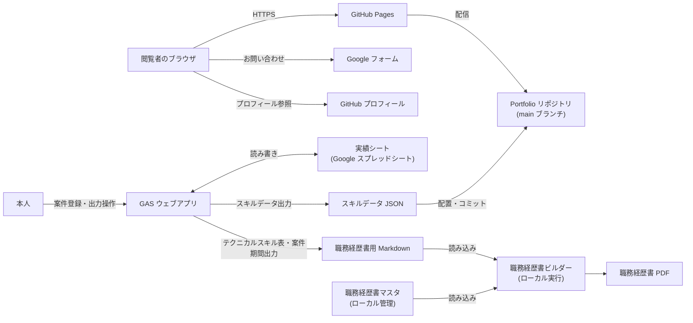
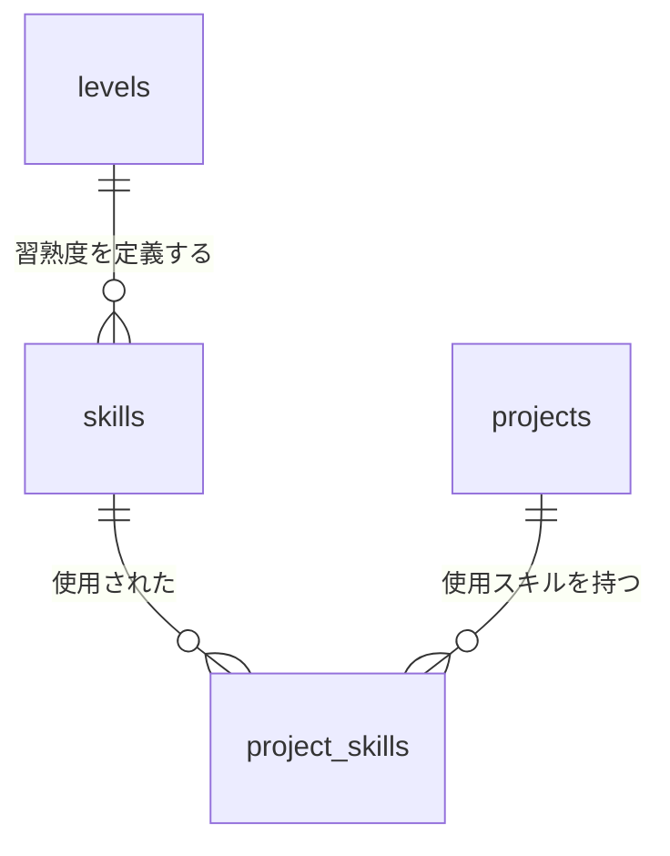
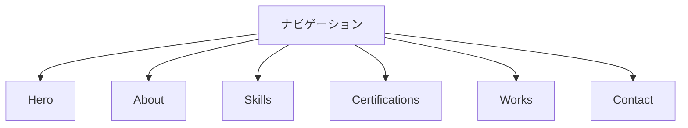
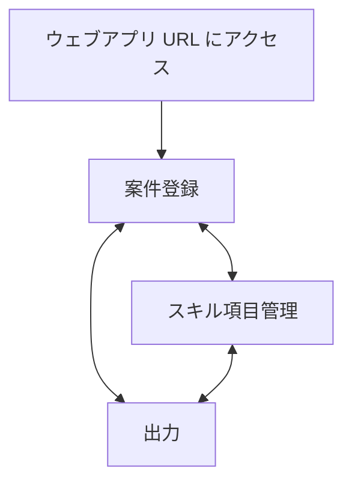

# 基本設計書 - Portfolio サイト / スキル実績管理

## 1. システム構成

### 1.1. 前提インフラ

- GitHub Pages（`main` ブランチを直接公開する構成。GitHub Actions は使用しない）
- Google スプレッドシート（実績シート。本人の Google ドライブ上に配置する）
- Google Apps Script（実績シートに紐づくウェブアプリ）

### 1.2. 構成図



閲覧者のブラウザは実績シート・GAS ウェブアプリを参照しない。ポートフォリオサイトが読み込むのは
リポジトリにコミットされた静的ファイルのみとする。

GAS ウェブアプリはリポジトリへ直接書き込まない。出力したスキルデータ JSON は本人がダウンロードして
リポジトリへ配置し、通常の PR フローでコミットする。これにより GAS がリポジトリへの書き込み権限
（アクセストークン）を持たない構成とする。

## 2. 技術スタック

### 2.1. バージョン確定方針

- 外部ライブラリは最小限に留め、CDN 経由でバージョンを固定して読み込む

### 2.2. 採用ライブラリ

| ライブラリ | バージョン | 用途 | 配信元 |
| ---------- | ---------- | ---- | ------ |
| Font Awesome | 6.4.0 | アイコン表示 | cdnjs.cloudflare.com |
| Google Fonts (Inter) | 400 / 500 / 700 / 800 | 本文フォント | fonts.googleapis.com |

## 3. 機能設計

| 機能 | 実現方式 |
| ---- | -------- |
| ナビゲーション | アンカーリンク + CSS によるスムーズスクロール。`js/main.js` でモバイル用ハンバーガーメニューの開閉を制御する |
| Hero タイピングアニメーション | `js/main.js` が肩書き文字列配列を 1 文字ずつ `#typing-text` に追加・削除してループ再生する |
| About 年齢自動計算 | `js/main.js` が生年月日から現在日時との差分を計算し `#age-display` に描画する |
| Skills スキルバー | 実績シートが出力したスキルデータ JSON（[6.2](#62-ポートフォリオ用スキルデータjson)）を読み込み、カテゴリ別にグルーピングして描画する |
| 経験年数の算出 | 実績シートの案件実績（開始年月・終了年月・使用スキル）を年月に展開し、スキルごとにユニーク月数を集計して N年Mヶ月 に換算する（[4.7](#47-経験年数の算出)） |
| 案件期間の導出 | 案件実績が保持する開始年月・終了年月をそのまま用いる（[4.8](#48-案件期間の導出)） |
| ポートフォリオ用データ出力 | 集計結果をスキルデータ JSON として出力する（[6.2](#62-ポートフォリオ用スキルデータjson)） |
| 職務経歴書用データ出力 | 集計結果を `■テクニカルスキル` 表と `■開発経歴` の案件期間の Markdown として出力する（[6.3](#63-職務経歴書用データmarkdown)） |
| アクセス制御 | GAS ウェブアプリを本人のみアクセス可・本人の権限で実行する設定で公開する（[6.4](#64-gas-ウェブアプリ)） |
| 案件実績登録 | 案件の開始年月・終了年月（継続中の場合は未設定）とスキル項目のチェック状態を、その案件の実績として登録・更新する（[5.3.2](#532-スキル実績管理gas-ウェブアプリ)） |
| 直近案件の初期表示 | 登録画面の初期状態として、直近案件（終了年月が未設定の案件。なければ終了年月が最も新しい案件）の登録内容を表示する（[5.3.2](#532-スキル実績管理gas-ウェブアプリ)） |
| スキル項目の管理 | マスタ（`skills`）の追加・変更・削除を画面から行う。実績が紐づく項目は削除できない（[5.3.2](#532-スキル実績管理gas-ウェブアプリ)） |
| Certifications 資格一覧 | `js/data.js` の資格配列を `js/main.js` が `#certifications-container` に描画する |
| Works 実績カード | `js/data.js` の実績配列（`title` / `desc_ja` / リンク等）を `js/main.js` が `#works-container` に描画する |
| Contact | 静的な Google フォーム URL・GitHub プロフィール URL へのリンク（サイト内フォーム処理は持たない） |
| 表示文言の切り出し | `js/i18n.js` に `data-i18n` 属性と対応する文言を保持する。`currentLang` は `'ja'` に固定しており、言語切替 UI・英語リソースは持たない |

## 4. データ設計

### 4.1. 共通方針

- データベースは使用しない。スキル実績の蓄積先は Google スプレッドシート（実績シート）とする
- 実績シートは本人の Google ドライブ上に配置し、リポジトリでは管理しない
- 各シートの 1 行目をヘッダー行とし、GAS は列位置ではなくヘッダー名で列を解決する。
  列の追加・並べ替えが実装に影響しないようにするため
- シート名・列名は半角英小文字のスネークケースとする
- 年月は `YYYY-MM` 形式の文字列で保持し、対象列の表示形式は「書式なしテキスト」とする。
  表計算の日付型への自動変換によって値が変わることを避けるため
- 継続中の案件は終了年月を空文字列とし、未確定の状態を表す
- 実績の有無はレコードの有無で表す。有効・無効を示すフラグ列を持たない
- 集計値（経験年数・ユニーク月数）はシートに保持せず、出力時に都度算出する。
  実績と集計値が二重管理になることを避けるため

### 4.2. シート構成

| シート名 | 役割 | キー |
| -------- | ---- | ---- |
| `skills` | スキル項目マスタ | `skill_id` |
| `projects` | 案件実績（期間） | `project_id` |
| `project_skills` | 案件ごとの使用スキル実績 | `project_id` + `skill_id` |
| `levels` | 習熟度レベル定義 | `level` |



案件が期間（開始年月・終了年月）を保持し、案件ごとの使用スキルを `project_skills` に記録する。
登録操作を「対象案件の期間を入力し、使用したスキル項目をチェックする」1 セットに収めるためであり、
経験年数・案件期間・両出力に必要な情報はこの構成で充足する。

### 4.3. `skills`（スキル項目マスタ）

| 列名 | 型 | 必須 | 内容 |
| ---- | -- | ---- | ---- |
| `skill_id` | 文字列 | ○ | スキル項目の識別子。半角英小文字・数字・ハイフンで構成し、登録後は変更しない |
| `category` | 文字列 | ○ | 種類。ポートフォリオのカテゴリ見出し、職務経歴書の「種類」列に対応する |
| `name` | 文字列 | ○ | 表示名。ポートフォリオ・職務経歴書に共通で使用する |
| `level` | 整数 | ○ | 習熟度レベル。`levels` シートの `level` を参照する |
| `remarks` | 文字列 | - | 職務経歴書のレベル列に付記する補足（主要な使用サービス名等） |
| `sort_order` | 整数 | ○ | 同一 `category` 内での表示順 |

ポートフォリオと職務経歴書で異なるスキル項目一覧を持たない。両者の出力対象は本シートに一本化する。

### 4.4. `projects`（案件実績）

| 列名 | 型 | 必須 | 内容 |
| ---- | -- | ---- | ---- |
| `project_id` | 文字列 | ○ | 案件の識別子。半角英小文字・数字・ハイフンで構成し、登録後は変更しない |
| `name` | 文字列 | ○ | 案件名。職務経歴書マスタの `■開発経歴` に記載する案件名と一致させる |
| `start_year_month` | 文字列 | ○ | 開始年月（`YYYY-MM`） |
| `end_year_month` | 文字列 | - | 終了年月（`YYYY-MM`）。空文字列の場合は継続中を表す |
| `sort_order` | 整数 | ○ | 登録画面・一覧での表示順 |

`name` は、出力した期間を職務経歴書マスタのどの案件に対応させるかを判定するキーとなるため、
職務経歴書マスタ側の表記と一致させる。

案件の削除は、紐づく `project_skills` の実績も同時に削除する。経験年数の算出結果に影響するため、
削除前に画面上で確認を求める（[5.3.2](#532-スキル実績管理gas-ウェブアプリ)）。

### 4.5. `project_skills`（案件ごとの使用スキル実績）

| 列名 | 型 | 必須 | 内容 |
| ---- | -- | ---- | ---- |
| `project_id` | 文字列 | ○ | `projects` シートの `project_id` を参照する |
| `skill_id` | 文字列 | ○ | `skills` シートの `skill_id` を参照する |

- 1 行が「ある案件であるスキル項目を使用した」1 件の実績を表す縦持ち形式とする。
  スキル項目を追加・削除しても列構成が変わらないため
- `project_id` と `skill_id` の組み合わせは一意とし、重複して登録しない

### 4.6. `levels`（習熟度レベル定義）

| 列名 | 型 | 必須 | 内容 |
| ---- | -- | ---- | ---- |
| `level` | 整数 | ○ | 習熟度レベル（1〜5） |
| `portfolio_label` | 文字列 | ○ | ポートフォリオの凡例に表示する文言 |
| `resume_label` | 文字列 | ○ | 職務経歴書の「レベル」列に出力する文言 |

登録値は以下とする。

| `level` | `portfolio_label` | `resume_label` |
| ------- | ----------------- | -------------- |
| 5 | スペシャリスト (広範な知識と高い専門性) | 広範な知識と高い専門性をもって技術選定・標準化ができる |
| 4 | 上級 (中規模システム以上の設計・実装能力) | 中規模システム以上の設計・実装ができる |
| 3 | 中級 (一人称で開発可能) | 一人称で設計・開発ができる |
| 2 | 初級 (実務経験あり) | 実務での使用経験があり、指示のもとで作業ができる |
| 1 | 入門 (基礎学習済み) | 基礎を学習済みで、手順書をもとに作業ができる |

### 4.7. 経験年数の算出

1. 出力時点の年月を基準日とする
2. `projects` の各行について、`start_year_month` から `end_year_month`（空文字列の場合は基準日）
   までを年月に展開する
3. `project_skills` で案件に紐づく `skill_id` ごとに、その案件に紐づく全案件の展開年月を
   和集合し、異なり数をユニーク月数とする。同一年月に複数の案件で同一のスキル項目を使用した
   場合も 1 ヶ月として数える
4. ユニーク月数を 12 で除した商を年数、剰余を月数とする
5. 以下の規則で表記に変換する

| 条件 | 表記 | 例 |
| ---- | ---- | -- |
| ユニーク月数が 0 | 出力対象外とする | - |
| ユニーク月数が 12 未満 | `Mヶ月` | `7ヶ月` |
| 12 以上かつ剰余が 0 | `N年` | `4年` |
| 12 以上かつ剰余が 0 以外 | `N年Mヶ月` | `4年10ヶ月` |

- 使用実績が 1 件も存在しないスキル項目は、ポートフォリオ・職務経歴書のいずれにも出力しない
- 職務経歴書の「開始年」は、そのスキル項目が紐づく案件の `start_year_month` の最小値の年とする

### 4.8. 案件期間の導出

- `projects` の `start_year_month`・`end_year_month` をそのまま用いる
- `end_year_month` が空文字列の場合は継続中とみなし、終了年月を「現在」と表記する
- 表記は `YYYY年MM月〜YYYY年MM月`、継続中の場合は `YYYY年MM月〜現在` とする

## 5. 画面設計

### 5.1. 画面一覧

#### 5.1.1. ポートフォリオサイト

| 画面 | 内容 |
| ---- | ---- |
| index.html | Hero / About / Skills / Certifications / Works / Contact の全セクションを含む単一ページ |

#### 5.1.2. スキル実績管理（GAS ウェブアプリ）

| 画面 | 内容 |
| ---- | ---- |
| 案件登録 | 案件の開始年月・終了年月とスキル項目をチェックして案件実績を保存する。案件の一覧・追加・変更・削除もここで行う。初期表示の画面とする |
| スキル項目管理 | スキル項目マスタ（`skills`）の一覧・追加・変更・削除 |
| 出力 | ポートフォリオ用 JSON・職務経歴書用 Markdown のプレビュー、ダウンロード、クリップボードへのコピー |

### 5.2. 画面遷移図

#### 5.2.1. ポートフォリオサイト

ページ遷移は発生しない。ナビゲーションのアンカーリンクにより同一ページ内の各セクションへスクロール移動する。



#### 5.2.2. スキル実績管理（GAS ウェブアプリ）

単一の URL 上で動作する 1 ページのアプリケーションとし、画面上部のタブで 3 つの画面を切り替える。
どの画面からも他の全画面へ直接移動できる。



### 5.3. 主要画面の項目

#### 5.3.1. ポートフォリオサイト

| セクション | 主要項目 |
| ---------- | -------- |
| Hero | 氏名、タイピングアニメーションによる肩書き、キャッチコピー |
| About | 自己紹介文、年齢（自動計算）、職業、学歴、居住地、趣味、GitHub URL |
| Skills | カテゴリ別スキルバー（技術名 / 経験年数 / 習熟度） |
| Certifications | 取得資格の一覧 |
| Works | 実績タイトル、説明、リンク |
| Contact | Google フォームへのリンクボタン、GitHub アイコンリンク |

#### 5.3.2. スキル実績管理（GAS ウェブアプリ）

##### 案件登録

| 項目 | 内容 |
| ---- | ---- |
| 案件一覧 | `sort_order` 順に、`name` と導出した期間（[4.8](#48-案件期間の導出)）を表示する。行を選択すると下記の登録フォームに読み込む |
| 対象案件 | 一覧から選択した既存案件を編集するか、新規案件を作成するかを選ぶ |
| 案件名 | `name` を入力する（新規作成時） |
| 開始年月 | `start_year_month` を入力する |
| 終了年月 | `end_year_month` を入力する。継続中の場合は空欄のままにするチェックを設ける |
| スキル項目 | `skills` の全件を `category` ごとにグルーピングし、`sort_order` 順のチェックボックスで表示する。その案件で使用したスキル項目をチェックする |
| 保存ボタン | 入力内容をその案件の実績として保存する（新規作成または更新） |
| 削除ボタン | 選択中の案件を削除する。紐づく `project_skills` も同時に削除され経験年数に影響するため、確認ダイアログを表示してから実行する |

初期状態は次の規則で決定する。

| 案件の登録状況 | 初期状態 |
| -------------- | -------- |
| 直近案件（終了年月が未設定の案件。なければ終了年月が最も新しい案件）が存在する | その案件を選択した状態 |
| 案件が 1 件も登録されていない | 新規案件の作成状態（すべて未入力・未選択） |

保存は、対象案件の `projects` の行（開始年月・終了年月・案件名）を更新し、`project_skills` の
既存レコードを削除したうえでチェックされたスキル項目のレコードを追加する置き換え方式とする。
チェックを外したスキル項目の削除と新規スキル項目の追加を同一の操作で扱え、重複レコードが
発生しない。

##### スキル項目管理

| 項目 | 内容 |
| ---- | ---- |
| 一覧 | `category`・`sort_order` 順に、`name`・`level`・`remarks` を表示する。あわせてユニーク月数（経験年数）を参照表示する |
| 追加・変更 | `skill_id`（追加時のみ入力）、`category`、`name`、`level`（`levels` から選択）、`remarks`、`sort_order` を入力する。`category` は既存の種類から選択するほか、新しい種類の入力も可能とする |
| 削除 | 使用実績が 1 件も紐づかないスキル項目のみ削除できる。使用実績が紐づく項目は削除不可とし、その旨を表示する |

##### 出力

| 項目 | 内容 |
| ---- | ---- |
| ポートフォリオ用 JSON | 出力内容（[6.2](#62-ポートフォリオ用スキルデータjson)）のプレビュー、`skills.json` としてのダウンロード、コピー |
| 職務経歴書用 Markdown | 出力内容（[6.3](#63-職務経歴書用データmarkdown)）のプレビュー、Markdown ファイルとしてのダウンロード、コピー |
| 出力時の警告 | 使用実績が 1 件もないスキル項目（出力対象外）の件数、`levels` に存在しない `level` を持つスキル項目があればその一覧を表示する |

入力値の検証（`skill_id` / `project_id` の形式・一意性、年月の形式・開始年月と終了年月の前後関係、
参照先マスタの存在）はサーバー側で行い、画面側の入力制限のみに依存しない。

## 6. 外部インタフェース設計

### 6.1. 外部サービス連携

| 連携先 | 用途 | 方式 |
| ------ | ---- | ---- |
| Google フォーム | お問い合わせ受付 | 静的リンク（サイト内フォーム送信処理は持たない） |
| GitHub | プロフィール・リポジトリ参照 | 静的リンク |
| Font Awesome CDN / Google Fonts CDN | アイコン・フォント配信 | `<link>` タグによる読み込み |

### 6.2. ポートフォリオ用スキルデータ（JSON）

- 出力先は `data/skills.json` とし、リポジトリにコミットして同一オリジンの静的ファイルとして配信する
- 文字コードは UTF-8、改行コードは LF とする
- 案件に関する情報は含めない
- 配列の順序は `skills` シートの `category`・`sort_order` の順とする

```json
{
  "generated_at": "2026-09-30",
  "skills": [
    {
      "category": "パブリッククラウド",
      "name": "AWS",
      "months": 58,
      "years": "4年10ヶ月",
      "level": 5
    }
  ]
}
```

| キー | 内容 |
| ---- | ---- |
| `generated_at` | 出力日（`YYYY-MM-DD`） |
| `skills[].category` | `skills` シートの `category` |
| `skills[].name` | `skills` シートの `name` |
| `skills[].months` | ユニーク月数。表示には使わないが、再集計せずに値を検算できるよう保持する |
| `skills[].years` | [4.7](#47-経験年数の算出) の表記に変換した経験年数 |
| `skills[].level` | `skills` シートの `level` |

資格・実績の表示データは実績シートの管理対象外とし、本ファイルには含めない。

### 6.3. 職務経歴書用データ（Markdown）

職務経歴書ビルダーが読み込む Markdown を出力する。文章部分は出力対象に含めない。
職務経歴書マスタの本文は書き換えず、ビルダーが PDF 生成時に該当箇所を出力内容で差し替える
（[6.5](#65-職務経歴書ビルダーとの責務分担)）。

`■テクニカルスキル` の表。

```markdown
| 種類 | 項目 | 開始年 | 使用期間 | レベル |
| --- | --- | --- | --- | --- |
| パブリッククラウド | AWS | 2021年 | 4年10ヶ月 | 要件に合わせた設計・環境構築が可能（使用サービス: VPC, EC2, ECS） |
```

| 列 | 出力内容 |
| -- | -------- |
| 種類 | `skills` シートの `category` |
| 項目 | `skills` シートの `name` |
| 開始年 | 当該スキル項目が紐づく案件の `start_year_month` の最小値の年 |
| 使用期間 | [4.7](#47-経験年数の算出) の表記に変換した経験年数 |
| レベル | `levels` シートの `resume_label`。`skills` シートの `remarks` が設定されている場合は `（{remarks}）` を後置する |

- 行の順序は [6.2](#62-ポートフォリオ用スキルデータjson) と同一とする
- 「使用期間」は実測のユニーク月数を表す。初使用年からの経過年数を目安として示す従来の列と注記は使用しない

`■開発経歴` の案件期間。案件名と期間の対応を出力する。

```markdown
**2025年04月〜現在｜大手小売業向け基幹システム クラウド移行対応**
```

- 期間の表記は [4.8](#48-案件期間の導出) に従う
- 案件名は `projects` シートの `name` を出力し、体制・案件概要・業務内容等の本文は職務経歴書マスタを正とする。
  案件見出し行は `name` の一致で対応付け、期間部分のみを差し替える

### 6.4. GAS ウェブアプリ

実績シートに紐づくコンテナバインド型のスクリプトとして実装し、ウェブアプリとして公開する。

| 項目 | 方針 |
| ---- | ---- |
| 実行ユーザー | 本人（デプロイした本人の権限で実行する） |
| アクセス権限 | 本人のみ。Google アカウントでログインした本人以外は到達できない |
| 実績シートの共有 | 本人のみとし、他のユーザーへ共有しない |
| 要求する権限 | 実績シートの読み書きに限定する。Google ドライブ全体・外部サービスへの通信権限は要求しない |
| URL | 既存デプロイを更新する運用とし、URL を固定する |

サーバー側の公開関数（画面から呼び出す処理）は次のとおりとする。

| 処理 | 入力 | 出力 |
| ---- | ---- | ---- |
| 案件登録の初期表示データ取得 | なし | スキル項目マスタ、案件一覧、直近案件の登録内容（案件名・開始年月・終了年月・選択された `skill_id` の一覧） |
| 案件実績の保存 | `project_id`（更新時のみ）、案件名、開始年月、終了年月、選択された `skill_id` の一覧 | 保存結果 |
| 案件の削除 | `project_id` | 削除結果 |
| スキル項目の一覧・追加・変更・削除 | スキル項目の各項目 | 更新後の一覧 |
| 出力データの生成 | なし | ポートフォリオ用 JSON 文字列、職務経歴書用 Markdown 文字列、警告 |

- 実績シートへの書き込みを伴う処理は排他制御を行い、複数タブでの同時操作による不整合を防ぐ
- 集計は実績シートの全件を一括で読み込んだうえでメモリ上で行い、応答時間の目標
  （要件定義書 6.2）を満たす

### 6.5. 職務経歴書ビルダーとの責務分担

| 担当 | 責務 |
| ---- | ---- |
| GAS ウェブアプリ | 実績の蓄積・集計と、職務経歴書用 Markdown の生成。職務経歴書マスタの内容には一切触れない |
| 職務経歴書ビルダー（`tools/skillsheet-builder/`） | 職務経歴書マスタと、GAS ウェブアプリが出力した Markdown を読み込み、`■テクニカルスキル` 表と `■開発経歴` の案件期間を出力内容で差し替えて PDF を生成する。PDF 生成はローカル実行とする |
| 職務経歴書マスタ | 文章部分の正。`■テクニカルスキル` 表・案件期間は出力内容が優先されるため、マスタ側の該当箇所は手作業で更新しない |

職務経歴書マスタは個人情報・案件情報を含むため GAS ウェブアプリへ渡さない。
案件との対応付けは、出力側の案件名（`projects` シートの `name`）を鍵として、ビルダーがローカルで行う。

## 7. 非機能要件の実現方式

要件定義書「[6. 非機能要件](../01.requirements/REQUIREMENTS.md#6-非機能要件)」の各項目に対応する。

| 要件定義書の項番 | 項目 | 実現方式 |
| ---------------- | ---- | -------- |
| 6.1 | 可用性 | GitHub Pages の可用性に委譲する。ポートフォリオサイトは閲覧時に実績シートを参照せず、出力済みの静的ファイルのみを読み込むため、スキル実績管理の停止による影響を受けない |
| 6.2 | 性能 | 外部ライブラリを Font Awesome・Google Fonts のみに限定し、依存を最小化する |
| 6.3 | セキュリティ | 実績シート・GAS ウェブアプリは本人の Google アカウントのみがアクセスできるものとし（[6.4](#64-gas-ウェブアプリ)）、案件情報を公開データへ出力しない。職務経歴書の実データは本リポジトリに一切含めず、`tools/skillsheet-builder/` に公開するのはダミーデータのみとする（詳細は [8. 職務経歴書の管理方式](#8-職務経歴書の管理方式)を参照） |
| 6.4 | バックアップ・リストア | ソースおよびスキルデータ JSON は GitHub リポジトリの履歴で管理する。実績シートは Google ドライブの版管理で世代を保持する |
| 6.5 | 運用・保守 | CI/CD を用いず、`main` ブランチへのマージで GitHub Pages に反映する |
| 6.6 | コスト | GitHub Pages の無料枠内で運用する |
| 6.7 | 移植性・保守性 | フレームワーク非依存の Vanilla HTML/CSS/JavaScript 構成とする |

## 8. 職務経歴書の管理方式

Portfolio サイト本体（1〜7 章）とは独立した、個人の職務経歴書（スキルシート）運用に関する設計を記載する。

- 作業ディレクトリは本リポジトリ内のパス `skillsheet/` に配置する。実体は Google ドライブの
  同期フォルダ（`/mnt/g/履歴書関連/skillsheet/`）に置き、`skillsheet/` はそこへの
  シンボリックリンクとする
- `.gitignore` により `skillsheet` を除外し、GitHub には一切アップロードしない
- 履歴管理はリモートを持たないローカル git リポジトリで行う。git 管理領域（`.git`）は
  Google ドライブの同期対象外（`~/.local/share/skillsheet/git`）に配置し、`.git` ファイル
  （`gitdir: ...`）で参照する。同期中のファイル書き込みによる git リポジトリ破損を避けるため
- バックアップは Google ドライブによるリアルタイム同期で担保する。手動でのファイルコピーは不要
- Python 仮想環境（`.venv`）は Google ドライブに同期させず、ローカル
  （`~/.local/share/skillsheet/venv`）に配置する
- PDF 生成はローカルの `build_pdf.py` 実行で行い、GitHub Actions 等の CI は使用しない
- ビルドスクリプトとテンプレートは、架空のダミーデータを同梱した形で Portfolio リポジトリの
  `tools/skillsheet-builder/` に公開する。実データは同梱しない
- 公開ツールのセットアップ手順・実行方法は [`tools/skillsheet-builder/README.md`](../tools/skillsheet-builder/README.md) を参照

## 9. ディレクトリ構成

```text
Portfolio/
├── index.html               # エントリーポイント
├── skillsheet/               # 職務経歴書ローカル作業ディレクトリ
│                              # （Googleドライブへのシンボリックリンク、.gitignoreで除外）
├── css/
│   ├── style.css            # メインスタイルシート
│   ├── variables.css        # CSS変数定義（色、フォント、サイズ）
│   ├── reset.css            # リセットCSS
│   └── components/          # コンポーネント別CSS
├── data/
│   └── skills.json          # スキルデータ（実績シートの出力。手作業で編集しない）
├── js/
│   ├── main.js               # メインロジック（UI操作、イベント）
│   ├── data.js                # コンテンツデータ（スキル、資格、実績）
│   └── i18n.js                 # 表示文言データ（日本語のみ）
├── assets/
│   ├── images/               # 画像ファイル
│   └── fonts/                  # フォントファイル
├── img/                       # サイト掲載用画像
├── gas/                       # スキル実績管理 GAS ウェブアプリのソース
├── tools/
│   └── skillsheet-builder/    # 職務経歴書ビルダー（ダミーデータ同梱、実データは非同梱）
└── docs/
    ├── 01.requirements/         # 要件定義
    │   └── REQUIREMENTS.md
    ├── 02.design/               # 基本設計
    │   └── DESIGN.md
    └── 04.procedures/           # 構築・運用手順書
```
