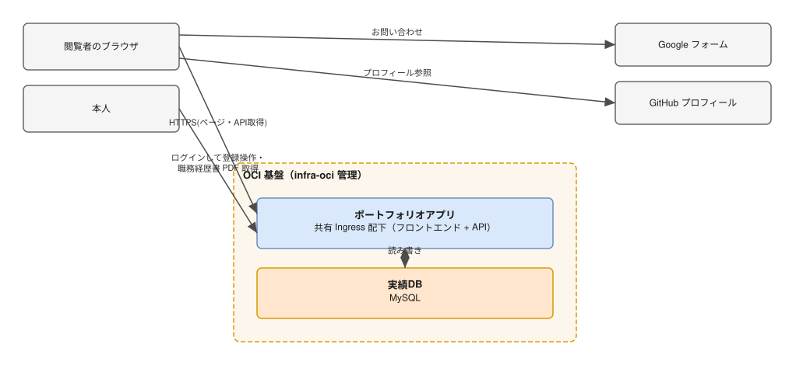
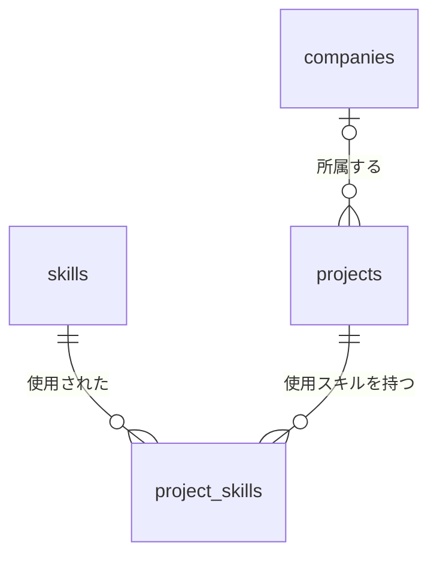
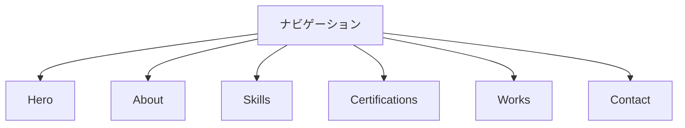
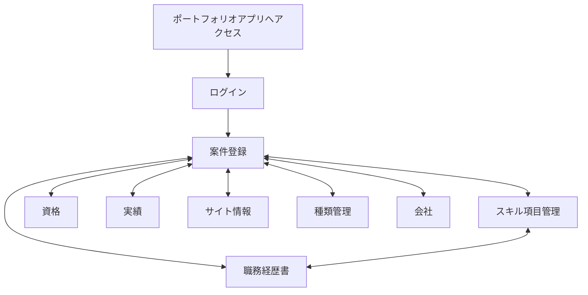
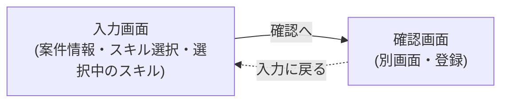
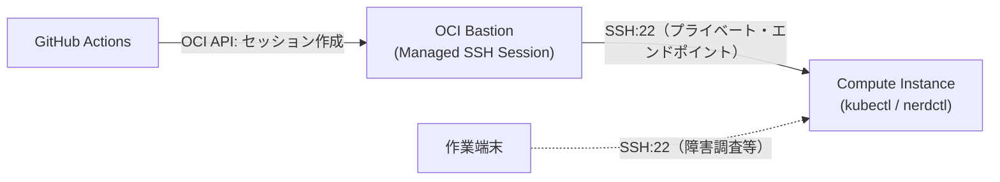

# 基本設計書 - Portfolio サイト / スキル実績管理

## 1. システム構成

### 1.1. 前提インフラ

- OCI 基盤（infra-oci リポジトリが管理する Kubernetes クラスタ・MySQL・共有 Ingress）。
  基盤自体の構築・運用は infra-oci リポジトリの責務であり、本リポジトリはその上で動作する
  ポートフォリオアプリ（コンテナイメージ・アプリケーションコード）のみを管理する。
  ポートフォリオサイト（フロントエンド）のホスティングもこのポートフォリオアプリに含める
  （GitHub Pages は用いない）

### 1.2. 構成図

[別紙: システム構成図](99.appendix/別紙_システム構成図.drawio.svg)



閲覧者のブラウザは、ポートフォリオサイトのページ・表示データ（スキル・資格・実績）のいずれも
同一のポートフォリオアプリから取得する。ページ本体とデータ取得用 API が同一オリジンとなるため、
クロスオリジン通信の制御は発生しない。案件情報を含む登録操作は本人のログインを要する画面からのみ行う。

ポートフォリオアプリ・実績 DB の実体（Kubernetes・MySQL）は infra-oci リポジトリが管理する OCI 基盤上に
配置する。本リポジトリはアプリケーションのソースコード・コンテナイメージ定義・Kubernetes
マニフェスト（Deployment・Service）を管理し、基盤自体のリソース定義は持たない。

## 2. 技術スタック

### 2.1. バージョン確定方針

- 外部ライブラリは最小限に留め、CDN 経由でバージョンを固定して読み込む
- ポートフォリオアプリは、infra-oci 基盤上の既存アプリ（kakeibo）と技術スタックを揃え、
  基盤側の運用手順（コンテナビルド・Kubernetes マニフェストの様式）を再利用する

### 2.2. 採用ライブラリ

| ライブラリ | バージョン | 用途 | 配信元 |
| ---------- | ---------- | ---- | ------ |
| Font Awesome | 6.4.0 | アイコン表示 | cdnjs.cloudflare.com |
| Google Fonts (Shippori Mincho) | 600 / 800 | 見出し・氏名のフォント | fonts.googleapis.com |
| Google Fonts (Zen Kaku Gothic New) | 400 / 500 / 700 | 本文フォント | fonts.googleapis.com |

ポートフォリオアプリ（`webapp/`）の言語・フレームワーク・バージョンは
[`webapp/README.md`](../../webapp/README.md) を正とする。

## 3. 機能設計

| 機能 | 実現方式 |
| ---- | -------- |
| ナビゲーション | アンカーリンク + CSS によるスムーズスクロール。`js/main.js` でモバイル用ハンバーガーメニューの開閉（Esc キー・リンク選択で閉じる）を制御する |
| Hero 構成レイヤー図 | インフラの構成レイヤー（クラウド・IaC・CI/CD）を等角投影で描いたインライン SVG を Hero に配置する。読み込み時に一度だけレイヤーが積み上がるアニメーションを再生し、動きを減らす設定の環境では無効にする |
| Hero タイピングアニメーション | `js/main.js` が肩書き文字列配列を 1 文字ずつ `#typing-text` に追加・削除してループ再生する。動きを減らす設定の環境では最初の肩書きを固定表示する |
| サイト情報の表示 | ポートフォリオアプリの読み取り専用 API（[6.2](#62-ポートフォリオ用読み取り専用api)）を `fetch` で呼び出し、`js/main.js` が Hero（氏名・肩書き・キャッチコピー）、About（自己紹介文・年齢・職業・学歴・居住地・趣味・GitHub URL）、Contact（案内文・問い合わせフォーム URL・GitHub URL）、フッター（氏名・著作権表示の年）を描画する。年齢は API が生年月日から算出して返し、著作権表示の年は API 呼び出し時点の年を返す |
| Skills レベルメーター | ポートフォリオアプリの読み取り専用 API（[6.2](#62-ポートフォリオ用読み取り専用api)）を `fetch` で呼び出し、カテゴリ別にグルーピングして描画する |
| 経験年数の算出 | 実績 DB の案件実績（開始年月・終了年月・使用スキル）を年月に展開し、スキルごとにユニーク月数を集計して N年Mヶ月 に換算する（[4.10](#410-経験年数の算出)） |
| 案件期間の導出 | 案件実績が保持する開始年月・終了年月をそのまま用いる（[4.11](#411-案件期間の導出)） |
| ポートフォリオ用データ提供 | 集計結果を API のレスポンスとして返す（[6.2](#62-ポートフォリオ用読み取り専用api)） |
| 職務経歴書データの管理 | 会社（`companies`）、案件の詳細（`projects` の詳細列）、文章項目（`skillsheet_texts`）を管理画面から項目ごとに登録・編集する（[4.9](#49-職務経歴書データ)・[5.3.2](#532-スキル実績管理ポートフォリオアプリ)） |
| 職務経歴書 PDF 生成 | 実績 DB の会社・案件・スキル実績・資格・文章項目から職務経歴書の Markdown を組み立て、HTML を経由して A4 の PDF に変換して返す。PDF はダウンロードのたびに生成し、サーバーに保存しない（[6.3](#63-職務経歴書の生成)） |
| アクセス制御 | 登録・変更操作は本人のログインを要する画面からのみ実行できる（[6.4](#64-ポートフォリオアプリ)） |
| 案件実績登録 | 案件の開始年月・終了年月（継続中の場合は未設定）とスキル項目のチェック状態を、その案件の実績として登録・更新する（[5.3.2](#532-スキル実績管理ポートフォリオアプリ)） |
| 直近案件の初期表示 | 登録画面の初期状態として、直近案件（終了年月が未設定の案件。なければ終了年月が最も新しい案件）の登録内容を表示する（[5.3.2](#532-スキル実績管理ポートフォリオアプリ)） |
| スキル項目の 1 画面登録 | 案件登録画面で、スキル項目を `category` 単位のタブで切り替えながら 1 画面上で選択し、選択中の項目を常時表示する。パブリッククラウドの各提供元（AWS・Azure・OCI 等）も `category` の一つとして同じ仕組みでタブ化される（[5.3.2](#532-スキル実績管理ポートフォリオアプリ)） |
| スキル項目の管理 | マスタ（`skills`）の追加・変更・削除を画面から行う。実績が紐づく項目は削除できない（[5.3.2](#532-スキル実績管理ポートフォリオアプリ)） |
| Certifications 資格一覧 | ポートフォリオアプリの読み取り専用 API（[6.2](#62-ポートフォリオ用読み取り専用api)）を `fetch` で呼び出し、`js/main.js` が `#certifications-container` に描画する |
| Works 実績カード | ポートフォリオアプリの読み取り専用 API（[6.2](#62-ポートフォリオ用読み取り専用api)、`title` / `desc_ja` / リンク等）を `fetch` で呼び出し、`js/main.js` が `#works-container` に描画する |
| 資格・実績の管理 | ポートフォリオアプリの登録画面から資格（`certifications`）・実績（`works`）の追加・変更・削除を行う（[5.3.2](#532-スキル実績管理ポートフォリオアプリ)） |
| Contact | 静的な Google フォーム URL・GitHub プロフィール URL へのリンク（サイト内フォーム処理は持たない） |
| 表示文言の切り出し | `js/i18n.js` に `data-i18n` 属性と対応する文言を保持する。`currentLang` は `'ja'` に固定しており、言語切替 UI・英語リソースは持たない |

## 4. データ設計

### 4.1. 共通方針

- スキル・案件・使用実績・資格・実績・職務経歴書データの蓄積先は、infra-oci 基盤の MySQL 上に配置する実績 DB とする
- 実績 DB は本リポジトリでは管理しない（テーブル定義・マイグレーションは `webapp/` 配下のアプリケーション
  コードで管理し、データベース自体のプロビジョニングは infra-oci リポジトリの責務とする）
- 各テーブルの列名は半角英小文字のスネークケースとする
- 年月は `YYYY-MM` 形式の文字列で保持する
- 継続中の案件は終了年月を空文字列（または NULL）とし、未確定の状態を表す
- 実績の有無はレコードの有無で表す。有効・無効を示すフラグ列を持たない
- 集計値（経験年数・ユニーク月数）はテーブルに保持せず、API 呼び出し時に都度算出する。
  実績と集計値が二重管理になることを避けるため
- スキーマの追加・変更はアプリケーションのマイグレーションで管理し、
  手作業によるテーブル操作を行わない

### 4.2. テーブル構成

| テーブル名 | 役割 | キー |
| ---------- | ---- | ---- |
| `skills` | スキル項目マスタ | `skill_id` |
| `skill_categories` | スキル項目の種類マスタ（種類の一覧と並び順） | `id` |
| `projects` | 案件実績（期間） | `project_id` |
| `project_skills` | 案件ごとの使用スキル実績 | `project_id` + `skill_id` |
| `certifications` | 資格 | `certification_id` |
| `works` | 実績（Works） | `work_id` |
| `site_info` | サイト全体の表示情報（Hero・About・Contact・フッター。1 行のみ） | `site_info_id` |
| `companies` | 会社（職務経歴書に記載する所属先・副業の契約先） | `company_id` |
| `skillsheet_texts` | 職務経歴書の文章項目（項目ごとに 1 行） | `text_key` |


```mermaid
erDiagram
    skills ||--o{ project_skills : "使用された"
    projects ||--o{ project_skills : "使用スキルを持つ"
    companies |o--o{ projects : "所属する"
```

案件が期間（開始年月・終了年月）を保持し、案件ごとの使用スキルを `project_skills` に記録する。
登録操作を「対象案件の期間を入力し、使用したスキル項目をチェックする」1 セットに収めるためであり、
経験年数・案件期間・両出力に必要な情報はこの構成で充足する。

`certifications`・`works`・`site_info` は `skills`・`projects` と参照関係を持たない独立したテーブルとし、
ポートフォリオサイトへの表示のみを目的とする。

`companies` は職務経歴書の会社見出しの単位であり、案件は `company_id` で所属する会社を参照する。
職務経歴書の案件見出し（期間・案件名）と案件の詳細は `projects` の値をそのまま用い、
案件名の文字列の一致による対応付けは行わない。`skillsheet_texts` は他のテーブルと参照関係を持たない。

### 4.3. `skills`（スキル項目マスタ）

| 列名 | 型 | 必須 | 内容 |
| ---- | -- | ---- | ---- |
| `skill_id` | 文字列 | ○ | スキル項目の識別子。半角英小文字・数字・ハイフンで構成し、登録後は変更しない |
| `category` | 文字列 | ○ | 種類。`skill_categories` の `name` と一致させる。ポートフォリオのカテゴリ見出し、職務経歴書の「種類」列、案件登録画面のページ単位に対応する |
| `subcategory` | 文字列 | - | サブカテゴリ。項目数の多い `category`（AWS 等）を案件登録画面でサブタブに分けるための区分。空文字の場合は区分しない。ポートフォリオ・職務経歴書には表示しない |
| `name` | 文字列 | ○ | 表示名。ポートフォリオ・職務経歴書に共通で使用する |
| `sort_order` | 整数 | ○ | 全スキル項目を通した表示順。管理画面では入力せず、種類の並び順と自動ソート（種類内はサブカテゴリ ＞ 表示名の昇順）から自動で採番する |

#### 4.3.1. `skill_categories`（種類マスタ）

| 列名 | 型 | 必須 | 内容 |
| ---- | -- | ---- | ---- |
| `id` | 整数 | ○ | 自動採番の識別子 |
| `name` | 文字列 | ○ | 種類名。重複不可。`skills` の `category` と同じ値で対応付ける（外部キーは持たない） |
| `sort_order` | 整数 | ○ | 種類の表示順。ポートフォリオ・職務経歴書・案件登録画面の種類の並び順を決める |

スキル項目を持たない種類も登録できる。種類の名称変更は、対応する `skills` の `category` も同時に更新する。

ポートフォリオと職務経歴書で異なるスキル項目一覧を持たない。両者の出力対象は本テーブルに一本化する。

パブリッククラウドは、クラウドサービス提供元（AWS・Azure・OCI 等）を `category` とし、
提供元が持つサービス（EC2・VPC・RDS 等）を `name` に持つスキル項目として、他のスキル項目と
同様に本テーブルへ登録する。「パブリッククラウド」という単一の `category` や、クラウド名を
`name` とするスキル項目は持たない。クラウドの提供元単位で経験年数を管理する上位項目は
設けず、サービス単位の項目のみを管理する。
AWS のように項目数が多い提供元は、`subcategory` に AWS 公式のサービスカテゴリ（Compute・
Networking & Content Delivery 等）を設定して区分する。
AWS のサービスは、他の `category`（コンテナ・データベース等）には登録せず、すべて `category` が AWS の
スキル項目に集約する。

### 4.4. `projects`（案件実績）

| 列名 | 型 | 必須 | 内容 |
| ---- | -- | ---- | ---- |
| `project_id` | 文字列 | ○ | 案件の識別子。案件登録画面では入力させず、サーバー側で自動採番する。登録後は変更しない |
| `name` | 文字列 | ○ | 案件名。案件登録画面での識別と、職務経歴書の案件見出しに共通で用いる |
| `start_year_month` | 文字列 | ○ | 開始年月（`YYYY-MM`） |
| `end_year_month` | 文字列 | - | 終了年月（`YYYY-MM`）。空値の場合は継続中を表す |
| `company_id` | 整数 | - | 所属する会社（`companies` の `company_id`）。未設定の案件は職務経歴書に出力しない |
| `team_size` | 文字列 | - | 体制（例: `14名体制`）。職務経歴書の案件見出しに括弧書きで添える |
| `overview` | 文字列（長文） | - | 案件概要 |
| `tasks` | 文字列（長文） | - | 業務内容。1 行を 1 項目とする |
| `phases` | 文字列 | - | 担当工程（例: `基本設計、詳細設計`） |
| `environment` | 文字列 | - | 環境・言語（例: `AWS、Python 3.14`） |

案件は期間（`start_year_month`）から表示順が一意に定まるため、スキル項目マスタと異なり
`sort_order` 列は持たない。

`company_id` 以降の列（以下、案件の詳細）は職務経歴書にのみ用いる任意項目とし、空の項目は職務経歴書に出力しない。
「環境・言語」は `project_skills` の使用スキルとは別に保持する。職務経歴書向けに製品名・バージョンの
表記を自由に記述するためであり、経験年数の算出には用いない。

案件の削除は、紐づく `project_skills` の実績も同時に削除する。経験年数の算出結果に影響するため、
削除前に画面上で確認を求める（[5.3.2](#532-スキル実績管理ポートフォリオアプリ)）。

### 4.5. `project_skills`（案件ごとの使用スキル実績）

| 列名 | 型 | 必須 | 内容 |
| ---- | -- | ---- | ---- |
| `project_id` | 文字列 | ○ | `projects` の `project_id` を参照する |
| `skill_id` | 文字列 | ○ | `skills` の `skill_id` を参照する |
| `version` | 文字列 | - | その案件でそのスキル項目を使用した際のバージョン（例: `3.14`、`X 5.3`）。バージョンの概念がない項目や、特定しない場合は空文字列とする |

- 1 行が「ある案件であるスキル項目を使用した」1 件の実績を表す縦持ち形式とする
- `project_id` と `skill_id` の組み合わせは一意とし、重複して登録しない
- `version` はスキル項目マスタ（`skills`）ではなく案件ごとの実績側で保持する。同一のスキル項目でも
  案件によって使用したバージョンが異なりうるため

### 4.6. `certifications`（資格）

| 列名 | 型 | 必須 | 内容 |
| ---- | -- | ---- | ---- |
| `certification_id` | 整数 | ○ | 資格の識別子。サーバー側で自動採番する |
| `name` | 文字列 | ○ | 資格名 |
| `acquired_on` | 日付 | ○ | 取得年月。年月の粒度で管理し、その月の 1 日を保持する。表示は `YYYY年MM月` に整形する。表示順はこの日付の昇順（古い順）とし、同じ年月は登録の古い順（`certification_id` の昇順）とする |
| `org` | 文字列 | ○ | 発行団体 |

### 4.7. `works`（実績）

| 列名 | 型 | 必須 | 内容 |
| ---- | -- | ---- | ---- |
| `work_id` | 整数 | ○ | 実績の識別子。サーバー側で自動採番する |
| `title` | 文字列 | ○ | 実績タイトル |
| `desc_ja` | 文字列 | ○ | 説明文（日本語） |
| `desc_en` | 文字列 | - | 説明文（英語） |
| `tags` | 文字列（JSON 配列） | - | 使用技術タグの一覧 |
| `thumbnail` | 文字列 | - | サムネイル画像の保存先（アップロード画像の保存領域からの相対パス。省略時は既定のプレースホルダーを使う） |
| `github_url` | 文字列 | - | GitHub リポジトリへのリンク |
| `achieved_on` | 日付 | ○ | 実績年月。年月の粒度で管理し、その月の 1 日を保持する。表示は `YYYY年MM月` に整形する。日付の導入前に登録した行は未設定を許容し、更新時に入力を必須とする |
| `live_url` | 文字列 | - | 公開 URL へのリンク |

表示順は `achieved_on` の降順（未設定は末尾）、同じ年月は登録の新しい順（`work_id` の降順）とする。

### 4.8. `site_info`（サイト全体の表示情報）

ポートフォリオサイトの Hero・About・Contact・フッターに表示する情報を保持する。行は常に 1 件のみとし、
追加・削除は行わず変更のみとする。ナビゲーション・セクション見出し・表の列名などの固定ラベルは
サイトの構造の一部であり、頻繁に更新されないため本テーブルでは管理しない。

| 列名 | 型 | 必須 | 内容 |
| ---- | -- | ---- | ---- |
| `site_info_id` | 整数 | ○ | 識別子。1 行のみのため固定値とする |
| `name` | 文字列 | ○ | 氏名（Hero・フッターに表示） |
| `typing_titles` | 文字列（JSON 配列） | ○ | Hero のタイピングアニメーションに表示する肩書きの一覧 |
| `catchphrase` | 文字列 | ○ | Hero のキャッチコピー |
| `intro` | 文字列 | ○ | About の自己紹介文（改行を含む） |
| `birth_date` | 日付 | ○ | 生年月日。年齢の算出にのみ用い、公開 API へは出力しない |
| `job` | 文字列 | ○ | 職業 |
| `education` | 文字列 | ○ | 学歴 |
| `location` | 文字列 | ○ | 居住地 |
| `hobby` | 文字列 | ○ | 趣味 |
| `github_url` | 文字列 | ○ | GitHub URL（About・Contact で共用） |
| `contact_message` | 文字列 | ○ | Contact の案内文（改行を含む） |
| `contact_form_url` | 文字列 | ○ | 問い合わせフォームの URL |
| `copyright_start_year` | 整数 | ○ | フッターの著作権表示の開始年。表示は `開始年-現在の年` とし、開始年と現在の年が同じ場合は 1 つの年のみ表示する |

### 4.9. 職務経歴書データ

職務経歴書の記載内容のうち、案件実績・スキル項目・資格から生成しない部分を保持する。
いずれも最新版のみを保持し、変更履歴は持たない。

#### 4.9.1. `companies`（会社）

| 列名 | 型 | 必須 | 内容 |
| ---- | -- | ---- | ---- |
| `company_id` | 整数 | ○ | 会社の識別子。サーバー側で自動採番する |
| `name` | 文字列 | ○ | 会社名（例: `株式会社〇〇`） |
| `department` | 文字列 | - | 部署名 |
| `employment_type` | 文字列 | - | 雇用・契約形態（例: `正社員`、`業務委託`） |
| `kind` | 文字列 | ○ | 区分。`main`（本業）または `side`（副業）。職務経歴書の `■開発経歴`・`■副業` のどちらに記載するかを決める |
| `start_year_month` | 文字列 | ○ | 在籍開始年月（`YYYY-MM`） |
| `end_year_month` | 文字列 | - | 在籍終了年月（`YYYY-MM`）。空値の場合は在籍中を表す |
| `capital` | 文字列 | - | 資本金（例: `200万円`） |
| `employees` | 文字列 | - | 従業員数（例: `連結3,387名`） |
| `offices` | 文字列 | - | 拠点数（例: `8拠点`） |
| `annual_sales` | 文字列 | - | 年商（例: `222億円`） |
| `founded` | 文字列 | - | 設立（例: `2008年5月`） |

- 会社概要の列（`capital` 〜 `founded`）は、職務経歴書に記載する文言をそのまま保持する。
  集計・比較に用いないため数値化しない
- 表示順は `kind` ごとに `start_year_month` の降順とし、同じ年月は `company_id` の昇順とする
- 所属する案件がある会社は削除できない

#### 4.9.2. `skillsheet_texts`（職務経歴書の文章項目）

| 列名 | 型 | 必須 | 内容 |
| ---- | -- | ---- | ---- |
| `text_key` | 文字列 | ○ | 項目のキー（下表） |
| `body` | 文字列（長文） | ○ | 内容。`full_name` は 1 行の文字列、それ以外は Markdown（段落・箇条書き・太字）とする |
| `updated_at` | 日時 | ○ | 最終更新日時。保存時にサーバー側で設定する |

| `text_key` | 項目 | 職務経歴書の出力先 |
| ---------- | ---- | ------------------ |
| `full_name` | 氏名 | 冒頭の `氏名:` |
| `summary` | 職務概要 | `■職務概要` |
| `strengths` | 活かせる経験・得意分野 | `■活かせる経験・得意分野` |
| `self_pr` | 自己PR | `■自己PR` |

- 項目の種類はアプリケーションで固定し、画面から追加・削除しない
- 行が存在しない項目は未入力として扱い、初回の保存で作成する。削除は行わない
- 項目の見出し（`■職務概要` 等）は職務経歴書の生成時に付与するため、`body` には含めない。
  `body` を Markdown とするのは、自己PR の小見出し（太字）や得意業務の箇条書きなど、項目内の書式を保つため
- 保存は項目ごとに、編集を開始した時点の `updated_at` を添えて行い、保存時点の値と一致しない場合は保存しない。
  変更履歴を持たないため、複数タブからの保存で後勝ちによる上書きが起きないようにする

### 4.10. 経験年数の算出

1. 出力時点の年月を基準日とする
2. `projects` の各行について、`start_year_month` から `end_year_month`（空値の場合は基準日）
   までを年月に展開する
3. `project_skills` で案件に紐づく `skill_id` ごとに、その案件に紐づく全案件の展開年月を
   和集合し、異なり数をユニーク月数とする。同一年月に複数の案件で同一のスキル項目を使用した
   場合も 1 ヶ月として数える
4. ユニーク月数を 12 で除した商を年数、剰余を月数とする
5. 以下の規則で表記に変換する

| 条件 | 表記 | 例 |
| ---- | ---- | -- |
| ユニーク月数が 0 | 出力対象外とする | - |
| ユニーク月数が 12 未満 | `Mヶ月` | `7ヶ月` |
| 12 以上かつ剰余が 0 | `N年` | `4年` |
| 12 以上かつ剰余が 0 以外 | `N年Mヶ月` | `4年10ヶ月` |

ポートフォリオのスキル表示では、ユニーク月数から以下の規則で星の段階（1〜5）を算出する。

| 星 | ユニーク月数 | 経験年数 |
| -- | ------------ | -------- |
| 1 | 6 未満 | 半年未満 |
| 2 | 6 以上 12 未満 | 半年以上 1 年未満 |
| 3 | 12 以上 36 未満 | 1 年以上 3 年未満 |
| 4 | 36 以上 60 未満 | 3 年以上 5 年未満 |
| 5 | 60 以上 | 5 年以上（最上位） |

- 使用実績が 1 件も存在しないスキル項目は、ポートフォリオ・職務経歴書のいずれにも出力しない
- 職務経歴書の「開始年」は、そのスキル項目が紐づく案件の `start_year_month` の最小値の年とする

### 4.11. 案件期間の導出

- `projects` の `start_year_month`・`end_year_month` をそのまま用いる
- `end_year_month` が空値の場合は継続中とみなし、終了年月を「現在」と表記する
- 表記は `YYYY年MM月〜YYYY年MM月`、継続中の場合は `YYYY年MM月〜現在` とする

## 5. 画面設計

### 5.1. 画面一覧

#### 5.1.1. ポートフォリオサイト

| 画面 | 内容 |
| ---- | ---- |
| index.html | Hero / About / Skills / Certifications / Works / Contact の全セクションを含む単一ページ |

#### 5.1.2. スキル実績管理（ポートフォリオアプリ）

| 画面 | 内容 |
| ---- | ---- |
| ログイン | 本人のみがログインできる認証画面 |
| 案件登録 | 継続中の案件（なければ新規案件）の開始年月・終了年月とスキル項目を 1 画面で選んで案件実績を保存する。削除もここで行う。利用頻度の低い操作として、終了済みの案件を選んで登録内容を訂正する枠を別に設ける。ログイン後の初期表示画面とする |
| スキル項目管理 | スキル項目マスタ（`skills`）の一覧（種類フィルタ・キーワード検索付き）、追加・変更を行う編集画面。編集画面は一覧とは別画面として切り替わる |
| 資格 | `certifications` の一覧・追加・変更・削除 |
| 実績 | `works` の一覧・追加・変更・削除 |
| サイト情報 | `site_info` の表示・変更 |
| 会社 | `companies` の一覧・追加・変更・削除 |
| 職務経歴書 | 職務経歴書のプレビュー（PDF に出力する内容）と PDF・Markdown のダウンロード、文章項目（`skillsheet_texts`）の編集（[6.3](#63-職務経歴書の生成)） |
| 種類管理 | 種類マスタ（`skill_categories`）の一覧・追加・名称変更・削除・並び替え。サイト管理者のみが行う作業のため、ナビゲーションの最下部（「出力・設定」グループ）に分離する |

管理画面の共通レイアウトは次のとおりとする。

| 項目 | 内容 |
| ---- | ---- |
| 配色 | 入力作業が多い本文は明るい灰青の地に白いカードを置くライト基調とし、ナビゲーションのみ公開サイトと同系統の紺地に琥珀の選択表示を用いる。主要操作は紺青のボタンで統一する |
| ナビゲーション | 紺地の左サイドバーに画面を用途別のグループで並べる。「登録」: 案件登録・会社、「掲載内容」: スキル項目管理・資格・実績・サイト情報、「出力・設定」: 職務経歴書・種類管理。幅 768px 未満ではサイドバーを折りたたみ、ヘッダーのボタンで開閉する |
| ヘッダー | ログアウト操作を表示する（幅 768px 未満では現在の画面名とメニューボタンも表示する） |
| ページ見出し | 各画面の先頭に画面名・件数などの補足・主要操作（追加、新規作成等）を 1 行にまとめて表示する |
| 一覧 | カード内にツールバー（種類フィルタ、キーワード検索、表示件数）と表を配置する。キーワード検索は表示中の列を対象に、入力と同時に絞り込む。該当がない場合は次の操作を案内する空状態を表示する |
| 追加・変更フォーム | 2 列のグリッドに入力欄を並べ（長文・画像は全幅）、操作ボタンは画面下部に追従する帯に置く。画面上部に一覧へ戻る導線を置く |
| 通知 | 保存などの完了通知は画面右上に表示し、入力を妨げない |

ポートフォリオ用の表示データは画面から出力する操作を持たず、常に API 呼び出し時点の実績 DB の
内容から生成する（[6.2](#62-ポートフォリオ用読み取り専用api)）。

### 5.2. 画面遷移図

#### 5.2.1. ポートフォリオサイト

ページ遷移は発生しない。ナビゲーションのアンカーリンクにより同一ページ内の各セクションへスクロール移動する。


```mermaid
flowchart TD
    Nav["ナビゲーション"] --> Hero
    Nav --> About
    Nav --> Skills
    Nav --> Certifications
    Nav --> Works
    Nav --> Contact
```

#### 5.2.2. スキル実績管理（ポートフォリオアプリ）

ログイン後、単一の URL 上で動作する 1 ページのアプリケーションとし、左サイドバーで
8 つの画面を切り替える。どの画面からも他の全画面へ直接移動できる。


```mermaid
flowchart TD
    Start["ポートフォリオアプリへアクセス"] --> Login["ログイン"]
    Login --> Project["案件登録"]
    Project <--> Skill["スキル項目管理"]
    Project <--> Cert["資格"]
    Project <--> Work["実績"]
    Project <--> Site["サイト情報"]
    Project <--> Output["職務経歴書"]
    Project <--> Category["種類管理"]
    Project <--> Company["会社"]
    Skill <--> Output
```

案件登録画面は、案件情報の入力とスキル項目の選択を 1 画面に配置し、ページ送りを行わない。
左の本文に「案件情報」「使用したスキル」を縦に並べ、右の「選択中のスキル」には選んだ項目を常時表示して
バージョンの入力と取り外しを行う。入力内容の確認は「確認へ」を押して遷移する別の確認画面で行い、
確認画面から登録の確定または入力への戻りを選べる。


```mermaid
flowchart LR
    Input["入力画面<br/>(案件情報・スキル選択・選択中のスキル)"] -->|確認へ| Confirm["確認画面<br/>(別画面・登録)"]
    Confirm -.入力に戻る.-> Input
```

### 5.3. 主要画面の項目

#### 5.3.1. ポートフォリオサイト

| セクション | 主要項目 |
| ---------- | -------- |
| Hero | 氏名、タイピングアニメーションによる肩書き、キャッチコピー（いずれも `site_info` の値） |
| 自己紹介（About） | 自己紹介文、年齢（自動計算）、職業、学歴、居住地、趣味、GitHub URL |
| スキル（Skills） | カテゴリ別のスキル一覧（技術名 / 経験年数 / 経験年数に基づく 5 段階のレベルメーター） |
| 資格（Certifications） | 取得資格の一覧（取得年月の古い順） |
| 実績（Works） | 実績タイトル、説明、リンク |
| お問い合わせ（Contact） | 案内文、問い合わせフォームへのリンクボタン、GitHub アイコンリンク（いずれも `site_info` の値） |
| フッター | 氏名、著作権表示（開始年〜現在の年） |

#### 5.3.2. スキル実績管理（ポートフォリオアプリ）

##### 案件登録

| 項目 | 内容 |
| ---- | ---- |
| 継続中の案件選択 | 継続中（終了年月が未設定）の案件を `start_year_month` の降順に並べたプルダウン。選択すると、その案件の内容を下記の登録フォームに読み込む。同一年月に複数の案件を並行することを想定し、継続中の案件が複数ある場合はここで切り替える |
| 終了済みの案件の訂正 | 継続中の案件選択とは別枠とし、既定では折りたたんだ状態で表示する（利用頻度が低いため）。展開すると終了済み（終了年月が設定済み）の案件を `end_year_month`・`start_year_month` の降順に並べたプルダウンを表示し、案件名と期間で識別できるようにする。選択すると、その案件の内容を下記の登録フォームに読み込み、継続中の案件と同じ手順で訂正・保存・削除できる |
| 新規作成ボタン | 入力内容を破棄し、新規案件の作成状態（すべて未入力・未選択）に切り替える |
| 案件情報 | `name`、`start_year_month`、`end_year_month`（継続中の場合は空欄のままにするチェックを設ける）を入力する。入力画面の先頭のカードに常時表示する |
| 職務経歴書の記載内容 | 案件情報の下に、既定では折りたたんだカードとして配置する（月次の使用スキル更新では使わないため）。`company_id`（会社のプルダウン。未設定も選べる）、`team_size`・`phases`・`environment`（1 行の入力欄）、`overview`・`tasks`（複数行の入力欄。業務内容は 1 行 1 項目）を入力する。いずれも任意とする |
| カテゴリタブ | 使用したスキルのカードの上部に、`skills` に存在する `category` ごとのタブを横に並べる。各タブには、そのカテゴリで選択中の項目数を表示する。クリックすると入力内容を保持したまま該当カテゴリの項目へ切り替える。パブリッククラウドの各提供元（AWS・Azure・OCI 等）も `category` の一つのため、他のカテゴリと同じ形式で表示される |
| スキル項目の選択 | 選択中のカテゴリのスキル項目を `sort_order` 順のチップ（クリックで選択・解除）で表示する。`subcategory` が設定された項目を持つカテゴリでは、先頭の「すべて」と `subcategory` 単位のサブタブを表示する。既定は「すべて」で、`subcategory` 単位のセクションに分けて全項目を表示し、それ以外のサブタブでは選択中のサブタブの項目のみを表示する（`subcategory` 単位のサブタブの順序は各 `subcategory` の `sort_order` 最小値の昇順。`subcategory` が空の項目は末尾の「その他」に含める）。カテゴリ・サブタブを切り替えても選択内容は保持する |
| 選択中のスキル | 入力画面の右側に常時表示する（幅 768px 未満では本文の下に配置する）。全カテゴリを通して選択された項目をカテゴリ別に一覧し、各項目に使用したバージョンを任意で入力できる。項目ごとの取り外しボタンで選択を解除できる。選択が 0 件の間は選び方を案内する。「確認へ」「削除」ボタンもここに置く |
| 確認へボタン | 案件情報の必須項目を検証したうえで、入力画面とは別の確認画面へ遷移する。未入力があれば案件情報のカードへ戻し、エラーを表示する |
| 確認画面 | 入力画面とは独立した画面とする。入力した案件情報、職務経歴書の記載内容（入力のある項目）と、全カテゴリを通して選択されたスキル項目（入力したバージョンを含む）の一覧を表示する |
| 入力に戻るボタン | 確認画面で、入力内容を保持したまま入力画面へ戻る |
| 登録ボタン | 確認画面で、入力内容をその案件の実績として保存する（新規作成または更新）。保存後は入力画面へ戻らず、保存結果を表示する |
| 削除ボタン | 編集中の案件を削除する。紐づく `project_skills` も同時に削除され経験年数に影響するため、確認ダイアログを表示してから実行する |

更新の対象は「継続中の案件」「新規の案件」「終了済みの案件」のいずれかとする。終了済みの案件の
訂正は、登録内容の誤りを直すための例外的な操作であり、継続中の案件の更新（月 1 回程度）に比べて
利用頻度が低い。そのため継続中の案件選択とは別の折りたたみ枠に分け、通常の更新操作の妨げにならない
ようにする。初期状態の決定規則（下記）には影響しない。終了済みの案件でも、終了年月を空欄にして
継続中に戻す変更は可能とする。

カテゴリページの順序は、各カテゴリに属するスキル項目の `sort_order` の最小値の昇順とする。
カテゴリをまたぐ順序のためだけに列を追加せず、既存の `sort_order` から一意に導出する。
選択状態（バージョンの入力内容を含む）は画面上のメモリに保持し、確認画面で
保存するまでデータベースへは書き込まない。

保存時には案件情報の必須項目（`name`・`start_year_month`）チェックを必ず行い、未入力であれば入力画面の案件情報のカードへ戻す。

初期状態は次の規則で決定する。

| 案件の登録状況 | 初期状態 |
| -------------- | -------- |
| 継続中の案件が存在する | `start_year_month` が最も新しいものを編集する状態として表示する。継続中の案件選択プルダウンで他の継続中案件へ切り替えられる |
| 継続中の案件が存在しない | 新規案件の作成状態（すべて未入力・未選択） |

保存は、対象案件の `projects` の行（開始年月・終了年月・案件名・案件の詳細）を更新し、`project_skills` の
既存レコードを削除したうえでチェックされたスキル項目とその `version`（未入力の場合は空文字列）の
レコードを追加する置き換え方式とする。チェックを外したスキル項目の削除と新規スキル項目の追加を
同一の操作で扱え、重複レコードが発生しない。

##### スキル項目管理

| 項目 | 内容 |
| ---- | ---- |
| 一覧 | `category`・`subcategory`・`name` の順に、`name` を表示する（種類間の順序は下記の並び替えに従い、種類内は `subcategory` ＞ `name` の昇順で自動的に並べる。`subcategory` が空の項目は種類内の末尾）。あわせてユニーク月数（経験年数）を参照表示する。`category`（種類）で絞り込むフィルタと、表示中の列を対象としたキーワード検索を持ち、フィルタの既定は「すべて」とする。追加・変更・削除後も選択中のフィルタを維持する |
| 追加・変更 | 一覧の「追加」「編集」で、一覧とは別の編集画面へ遷移する。保存またはキャンセルで一覧へ戻る。入力項目は次のとおり。`skill_id`（追加時のみ入力）、`category`、`subcategory`（任意）、`name` を入力する（`sort_order` は入力せず自動採番する）。`category`・`subcategory` は既存の値から選択するほか、新しい値の入力も可能とする（新しい `category` は種類マスタにも登録する） |
| 削除 | 使用実績が 1 件も紐づかないスキル項目のみ削除できる。使用実績が紐づく項目は削除不可とし、その旨を表示する |

##### 種類管理

種類の管理はサイト管理者のみが行う作業のため、管理画面のナビゲーションの最下部（「出力・設定」グループ）に設ける。

| 項目 | 内容 |
| ---- | ---- |
| 一覧 | 種類マスタ（`skill_categories`）を表示順に、種類名とスキル項目数を表示する |
| 追加 | 種類名を入力して追加する。既存の種類名と重複する名称、空の名称は登録できない。追加した種類は表示順の末尾に置く |
| 名称変更 | 種類名を変更する。対応するスキル項目の `category` も同時に更新する。既存の種類名への変更（統合）はできない |
| 並び替え | 種類単位で表示順を上下に入れ替える。結果はポートフォリオ・職務経歴書・案件登録画面のカテゴリ順にも反映する |
| 削除 | スキル項目が 1 件も属さない種類のみ削除できる。属する項目がある種類は削除不可とし、その旨を表示する |

保存・削除・並び替えのたびに、`sort_order`（スキル項目）を種類の並び順と種類内の昇順（`subcategory` ＞ `name`）に従って採番し直す。

##### 資格・実績・サイト情報管理

| 項目 | 内容 |
| ---- | ---- |
| 資格の一覧・追加・変更・削除 | 資格タブ。`acquired_on` の古い順に自動で並べて一覧表示し、`name`・`acquired_on`（月の入力欄。一覧・確認画面では `YYYY年MM月` で表示）・`org` を入力する（表示順は入力しない） |
| 実績の一覧・追加・変更・削除 | 実績タブ。`achieved_on` の新しい順に自動で並べて一覧表示し、`title`・`achieved_on`（月の入力欄。一覧・確認画面では `YYYY年MM月` で表示）・`desc_ja`・`desc_en`・`tags`・`thumbnail`（画像ファイルを選択してアップロードする。詳細は下記「実績画像のアップロード」）・`github_url`・`live_url` を入力する（表示順は入力しない） |
| サイト情報の表示・変更 | サイト情報タブ。現在の `site_info` の内容を表示画面に表示し、「編集」でフォームへ遷移する。フォームでは`name`・`typing_titles`（1 行 1 件で入力）・`catchphrase`・`intro`・`birth_date`・`job`・`education`・`location`・`hobby`・`github_url`・`contact_message`・`contact_form_url`・`copyright_start_year` を変更し、確認画面を経て保存する。行は常に 1 件のみで、追加・削除の操作は持たない |

##### 会社

| 項目 | 内容 |
| ---- | ---- |
| 一覧 | 区分（本業・副業）ごとに、在籍期間・会社名（部署）・雇用形態・所属する案件数を表示する。並び順は [4.9.1](#491-companies会社) に従う |
| 追加・変更 | 一覧の「追加」「編集」で編集画面へ遷移し、確認画面を経て保存する。入力項目は `name`・`department`・`employment_type`・`kind`（本業・副業の選択）・`start_year_month`・`end_year_month`（在籍中の場合は空欄のままにするチェックを設ける）・会社概要の各列とする |
| 削除 | 所属する案件がない会社のみ削除できる。案件がある会社は削除不可とし、その旨を表示する |

##### 実績画像のアップロード

実績の登録・編集画面で画像ファイルを選択すると、その時点で画像をサーバーへアップロードし、
保存先のパスを `thumbnail` に設定する（プレビューを表示する）。

| 項目 | 内容 |
| ---- | ---- |
| 対象形式・サイズ | png・jpg・jpeg・gif・webp、1 ファイル 5MB 以下。形式・サイズの違反はエラーとする |
| ファイル名 | 利用者の入力は使わず、サーバーが推測されにくい名前を採番する |
| 保存先 | アプリケーションの画像保存領域（`MEDIA_ROOT`）配下。本番は OCI ホストの hostPath を Pod にマウントして永続化する。画像ファイルは git の管理対象外とする |
| 配信 | 保存領域配下を `/media/` 配下でアプリケーションから配信する（認証不要） |
| 既存画像の移行 | 既存の実績画像は git から削除し、保存領域へ手動で配置する（構築手順書を参照）。`thumbnail` の値は既存の実績も含め `works/…` とし、アップロード画像と同じ保存先に配置する |
| 表示時の縦横比 | 公開画面の実績カードは画像を切り取らず全体を表示する（`object-fit: contain`）。画像枠とのアスペクト比の差で生じる余白は、同じ画像を拡大・ぼかしたものを背景に敷いて埋める。システムとしてはアスペクト比を問わずアップロードできる |
| 推奨アスペクト比 | 実績カードの画像枠は横長（16:9 目安）のため、画像自体を余白なしでこの比率に近づけて作成する運用とする。異なる比率の画像は背景のぼかしが目立つため、画像作成・選定の時点で 16:9 に合わせる |

##### 画面遷移と確認画面

スキル項目・種類・資格・実績・サイト情報・会社・職務経歴書の文章項目の各更新箇所は、「表示（一覧）」「編集（追加・変更のフォーム）」
「確認」を別画面として遷移する。案件登録は案件情報・カテゴリの入力ページから確認画面へ遷移する
（[案件登録](#案件登録)）。

| 画面 | 内容 |
| ---- | ---- |
| 表示 | 現在の内容の一覧（サイト情報は 1 件の内容）を表示する。追加・編集の操作を持つ |
| 編集 | 入力フォーム。「確認へ」で確認画面へ遷移し、「キャンセル」で表示へ戻る |
| 確認 | 入力内容を表示する。「入力に戻る」で入力内容を保持したまま編集へ戻り、「追加」「更新」を押した場合のみ実績 DB へ保存する |

- 変更の確認画面（サイト情報・資格・実績・会社・種類の名称変更・スキル項目の変更・職務経歴書の氏名）では、変更のあった項目のみを
  修正前・修正後の 2 列で並べて表示する。変更がない場合はその旨を表示する
- 職務経歴書の文章項目（氏名を除く）の確認画面では、長文のため 2 列表示に代えて、変更のあった行を追加・削除の差分形式で表示する
- 追加の確認画面では、入力内容の全項目を表示する
- 削除は確認ダイアログで確認する
- 保存・削除の完了通知（「保存しました」等）、およびエラー・警告は、いずれも画面中央のポップアップ
  （トースト）で表示する。完了通知・警告は数秒後、エラーはやや長めの秒数の後に自動で閉じる

##### 職務経歴書

| 項目 | 内容 |
| ---- | ---- |
| プレビュー（表示） | 画面を開いた時点の内容で生成した職務経歴書（[6.3](#63-職務経歴書の生成)）を、PDF と同じスタイルの HTML で表示する |
| PDF ダウンロード | 押した時点の内容で PDF を生成してダウンロードする。ファイル名は `職務経歴書_YYYYMMDD.pdf`（生成日） |
| 保存先の選択 | PDF・Markdown とも、File System Access API（`showSaveFilePicker`）が使えるブラウザ（Chrome・Edge 等）では保存ダイアログを表示し、選んだフォルダへ保存する（Google ドライブのデスクトップ版の同期フォルダ等）。ダイアログを取り消した場合は何もしない。非対応のブラウザ（Firefox・Safari）はブラウザの既定のダウンロードにフォールバックする。保存先はサーバーに記録せず、サーバーから Google ドライブへはアップロードしない |
| Markdown のダウンロード | 押した時点の内容で生成した職務経歴書の Markdown をダウンロードする。ファイル名は `職務経歴書_YYYYMMDD.md`（生成日）。変更履歴を持たないため、手元に控えを残す用途に用いる |
| 警告 | 生成時の警告（[6.3](#63-職務経歴書の生成)）を表示する |
| 文章項目 | 文章項目（[4.9.2](#492-skillsheet_texts職務経歴書の文章項目)）を一覧し、項目ごとに入力の有無・最終更新日時と「編集」を表示する。「編集」で項目の編集画面へ遷移し（氏名は 1 行の入力欄、他は全幅の複数行入力欄）、「確認へ」で確認画面へ遷移し、確認画面で「保存」を押した場合のみ保存する |
| 保存の競合 | 編集を開始した後に他のタブ等でその項目が保存されていた場合は保存せず、その旨のエラーを表示する（[4.9.2](#492-skillsheet_texts職務経歴書の文章項目)） |

案件の詳細は案件登録画面、会社は会社画面で編集し、職務経歴書画面では編集しない。

入力値の検証（`skill_id` / `project_id` の形式・一意性、年月の形式・開始年月と終了年月の前後関係、
参照先マスタの存在）はサーバー側で行い、画面側の入力制限のみに依存しない。

## 6. 外部インタフェース設計

### 6.1. 外部サービス連携

| 連携先 | 用途 | 方式 |
| ------ | ---- | ---- |
| ポートフォリオアプリ（OCI 基盤） | スキル・資格・実績データの取得 | `fetch` による HTTPS API 呼び出し（[6.2](#62-ポートフォリオ用読み取り専用api)） |
| Google フォーム | お問い合わせ受付 | 静的リンク（サイト内フォーム送信処理は持たない） |
| GitHub | プロフィール・リポジトリ参照 | 静的リンク |
| Font Awesome CDN / Google Fonts CDN | アイコン・フォント配信 | `<link>` タグによる読み込み |

### 6.2. ポートフォリオ用読み取り専用API

ポートフォリオアプリは、ポートフォリオサイトが読み込む表示データを認証不要の読み取り専用 API として
公開する。エンドポイントは infra-oci の共有 Ingress が割り当てるパスプレフィックス配下に置く
（パスの割り当ては
[infra-oci: ホスト名・パス割り当て台帳](https://github.com/Seiya-Nakagawa/infra-oci/blob/main/docs/02.design/99.appendix/ホスト名・パス割り当て台帳.md)
を正とする）。

| メソッド | パス | レスポンス |
| -------- | ---- | ---------- |
| `GET` | `/portfolio/api/skills` | スキルデータ（下記例） |
| `GET` | `/portfolio/api/certifications` | 資格データ |
| `GET` | `/portfolio/api/works` | 実績データ |
| `GET` | `/portfolio/api/site` | サイト情報データ（下記例） |

```json
{
  "generated_at": "2026-09-30",
  "skills": [
    {
      "category": "AWS",
      "name": "EC2",
      "months": 58,
      "years": "4年10ヶ月",
      "stars": 4
    }
  ]
}
```

| キー | 内容 |
| ---- | ---- |
| `generated_at` | 応答生成日時（`YYYY-MM-DD`） |
| `skills[].category` | `skills` の `category` |
| `skills[].name` | `skills` の `name` |
| `skills[].months` | ユニーク月数。表示には使わないが、再集計せずに値を検算できるよう保持する |
| `skills[].years` | [4.10](#410-経験年数の算出) の表記に変換した経験年数 |
| `skills[].stars` | [4.10](#410-経験年数の算出) の星の段階（1〜5）でユニーク月数から算出した値。`skills` の `level` は含めない |

```json
[
  {
    "name": "AWS Certified Solutions Architect – Professional",
    "date": "2024年07月",
    "org": "Amazon Web Services (AWS)"
  }
]
```

| キー | 内容 |
| ---- | ---- |
| `name` | 資格名 |
| `date` | 取得年月（`YYYY年MM月` 形式に整形した表示用の文言） |
| `org` | 発行団体 |

```json
[
  {
    "title": "Portfolio",
    "date": "2025年01月",
    "desc_ja": "当ポートフォリオサイト",
    "desc_en": "Renewal project of this portfolio website.",
    "tags": ["HTML", "CSS", "JS"],
    "thumbnail": "works/portfolio.png",
    "github_url": "https://github.com/Seiya-Nakagawa/Portfolio"
  }
]
```

| キー | 内容 |
| ---- | ---- |
| `title` | 実績タイトル |
| `date` | 実績年月（`YYYY年MM月` 形式に整形した表示用の文言。任意。未設定の場合は省略する） |
| `desc_ja` | 説明文（日本語） |
| `desc_en` | 説明文（英語） |
| `tags` | 使用技術タグの一覧 |
| `thumbnail` | サムネイル画像の保存先（任意。アップロード画像の保存領域からの相対パス。省略時は既定のプレースホルダーを使う） |
| `github_url` | GitHub リポジトリへのリンク（任意） |
| `live_url` | 公開 URL へのリンク（任意） |

```json
{
  "name": "Seiya Nakagawa",
  "typing_titles": ["Cloud Architect Engineer", "Full Stack Engineer"],
  "catchphrase": "ポートフォリオサイトへようこそ。",
  "intro": "クラウドアーキテクトエンジニアとして…",
  "age": 37,
  "job": "インフラ（クラウド）エンジニア",
  "education": "東海大学工学部 生命化学科卒",
  "location": "神奈川県綾瀬市在住",
  "hobby": "サウナ、サッカー観戦",
  "github_url": "https://github.com/Seiya-Nakagawa",
  "contact_message": "ご興味を持っていただけましたら…",
  "contact_form_url": "https://docs.google.com/forms/…",
  "copyright": "2024-2026"
}
```

| キー | 内容 |
| ---- | ---- |
| `name` | 氏名 |
| `typing_titles` | Hero の肩書きの一覧 |
| `catchphrase` | Hero のキャッチコピー |
| `intro` | 自己紹介文（改行を含む） |
| `age` | `site_info` の `birth_date` から API 呼び出し時点で算出した満年齢。生年月日そのものは返さない |
| `job` | 職業 |
| `education` | 学歴 |
| `location` | 居住地 |
| `hobby` | 趣味 |
| `github_url` | GitHub URL |
| `contact_message` | Contact の案内文（改行を含む） |
| `contact_form_url` | 問い合わせフォームの URL |
| `copyright` | フッターに表示する著作権の年表記。`copyright_start_year` と API 呼び出し時点の年から生成する |

- 案件に関する情報は含めない
- 配列の順序は、`skills` は `sort_order`、`certifications` は `acquired_on` の降順、
  `works` は `achieved_on` の降順（未設定は末尾。同じ年月は `work_id` の降順）とする
- ページ本体（`/portfolio/`）と本 API は同一オリジンのため、CORS の許可設定は不要とする
- ポートフォリオサイトは、`data/skills.json` 相当のローカルファイルを持たず、
  `js/main.js` が上記 API を `fetch` して各セクションを描画する。いずれかの読み込みに失敗した
  場合、該当セクションに読み込み失敗を示す文言を表示し、他のセクションの描画は継続する

### 6.3. 職務経歴書の生成

実績 DB の内容から職務経歴書を Markdown として組み立て、PDF を生成する。
職務経歴書の生成・取得・文章項目の編集はいずれも本人のログインを要する（[6.4](#64-ポートフォリオアプリ)）。

| 手順 | 処理 |
| ---- | ---- |
| 1 | 下記の構成に従い、各項目のデータを実績 DB から読み込んで Markdown を組み立てる |
| 2 | Markdown を HTML に変換する（表・改行を有効にする） |
| 3 | HTML を A4・縦の PDF に変換する |

職務経歴書の構成は次の順とする。内容が空の項目（未入力の文章項目、該当する会社がない区分等）は見出しごと出力しない。

| 順 | 見出し | 内容 | 出典 |
| -- | ------ | ---- | ---- |
| 1 | `# 職務経歴書` | `最終更新日:`（生成日。`YYYY年M月D日`）、`氏名:` | 生成日、`skillsheet_texts`（`full_name`） |
| 2 | `## ■職務概要` | 本文 | `skillsheet_texts`（`summary`） |
| 3 | `## ■職務経歴 概略` | 期間・会社名の表 | `companies`（`kind` が `main`） |
| 4 | `## ■開発経歴` | 会社見出し・会社概要と、所属する案件 | `companies`（`kind` が `main`）・`projects` |
| 5 | `## ■副業` | 同上 | `companies`（`kind` が `side`）・`projects` |
| 6 | `## ■テクニカルスキル` | スキルの表 | `skills`・`projects`・`project_skills` |
| 7 | `## ■活かせる経験・得意分野` | 本文 | `skillsheet_texts`（`strengths`） |
| 8 | `## ■保有資格` | 資格の一覧 | `certifications` |
| 9 | `## ■自己PR` | 本文 | `skillsheet_texts`（`self_pr`） |
| 10 | - | 末尾に `以上` | - |

`■職務経歴 概略` の表。

```markdown
| 期間 | 会社名 |
| --- | --- |
| 2021年08月〜現在 | 株式会社〇〇 システム事業部 |
```

- 本業（`kind` が `main`）の会社のみを [4.9.1](#491-companies会社) の順に並べる。副業は `■副業` に記載するため含めない
- 期間は在籍期間を [4.11](#411-案件期間の導出) と同じ表記にしたもの、会社名は `name` と `department`（空でなければ半角空白で連結）とする

`■開発経歴`・`■副業` の会社と案件。

```markdown
### 株式会社〇〇 システム事業部（正社員） 2021年08月〜現在

【資本金】200万円　【従業員数】20名　【設立】2008年5月

**2025年04月〜現在｜大手小売業向け基幹システム クラウド移行対応**（5名体制）

- 案件概要: オンプレミス環境の基幹システムを AWS へ移行
- 業務内容:
    - 基本設計・ドキュメント作成
    - 詳細設計・パラメータシート作成
- 担当工程: 基本設計、詳細設計
- 環境・言語: AWS、Terraform
```

| 要素 | 出力内容 |
| ---- | -------- |
| 会社見出し | 会社名（`name` と `department`）、`employment_type`（空でなければ全角括弧書き）、在籍期間 |
| 会社概要 | 値のある列のみを `【資本金】`・`【従業員数】`・`【拠点数】`・`【年商】`・`【設立】` の順に、全角空白区切りで 1 行に並べる。すべて空の場合は出力しない |
| 案件の並び | 所属する会社の下に `start_year_month` の降順で並べ、同じ年月は案件名の昇順とする |
| 案件見出し | `**期間｜案件名**`。期間は [4.11](#411-案件期間の導出) に従う。`team_size` がある場合は括弧書きで添える |
| 案件の詳細 | 値のある項目のみを `案件概要`・`業務内容`・`担当工程`・`環境・言語` の順に箇条書きで出力する。業務内容は 1 行のみの場合は `- 業務内容: …` とし、複数行の場合は各行を入れ子の箇条書きにする |

`■テクニカルスキル` の表。

```markdown
| 種類 | 項目 | 開始年 | 使用期間 |
| --- | --- | --- | --- |
| AWS | EC2 | 2021年 | 4年10ヶ月 |
```

| 列 | 出力内容 |
| -- | -------- |
| 種類 | `skills` の `category` |
| 項目 | `skills` の `name` |
| 開始年 | 当該スキル項目が紐づく案件の `start_year_month` の最小値の年 |
| 使用期間 | [4.10](#410-経験年数の算出) の表記に変換した経験年数 |

- 行の順序は [6.2](#62-ポートフォリオ用読み取り専用api) と同一とする
- 「使用期間」は実測のユニーク月数を表す。使用実績のないスキル項目は出力しない

`■保有資格` は、`- 資格名（YYYY年MM月）` の形式で `certifications` を [4.6](#46-certifications資格) の順に並べる。

生成時の警告は次のとおりとする。警告があっても生成は継続する。

| 条件 | 表示 |
| ---- | ---- |
| `company_id` が未設定の案件がある（職務経歴書に出力されない） | 該当する案件名の一覧 |
| 未入力の文章項目がある | 該当する項目名の一覧 |

利用者が入力した文字列は Markdown・HTML への変換時に表の区切り文字等をエスケープする。
PDF の生成時は `data:` 以外の外部リソースを読み込まず、ローカルファイルや内部ネットワークへアクセスしない。

PDF のレイアウトは、A4・余白（上下 18mm・左右 16mm）、本文 10.5pt の日本語ゴシック体（IPAex ゴシック）とし、
見出し・表に罫線と背景色を付けた印刷向けのスタイルとする。プレビューの HTML も同じスタイルを用いる。

### 6.4. ポートフォリオアプリ

infra-oci 基盤の Kubernetes 上に、コンテナ化したウェブアプリケーションとしてデプロイする。

| 項目 | 方針 |
| ---- | ---- |
| 公開範囲 | ポートフォリオサイトのページ本体・読み取り専用 API（[6.2](#62-ポートフォリオ用読み取り専用api)）は認証不要で公開する。登録・変更・削除操作および職務経歴書の参照・編集・PDF 生成は本人のログインを要する |
| ホスト名・パス | infra-oci の共有 Ingress が割り当てるホスト名配下のパスプレフィックス（`/portfolio`）で公開する。台帳は infra-oci リポジトリ側で管理する |
| データベース接続 | infra-oci 基盤の MySQL 上に新設する実績 DB に接続する。接続情報は OCI Vault を経由して取得し、アプリケーションコードに直書きしない |
| 画像の保存 | 管理画面からアップロードした実績画像は、OCI ホストの hostPath を Pod にマウントした保存領域へ保存し、Pod の再作成後も保持する。リポジトリでは管理しない |
| PDF 生成 | PDF はアプリケーション内で HTML から生成し、外部サービスを使わない。日本語フォント（IPAex ゴシック）をコンテナイメージに含め、実行環境のフォントに依存しない。使用するライブラリとバージョンは [`webapp/README.md`](../../webapp/README.md) を正とする |
| デプロイ方式 | infra-oci 基盤上の既存アプリ（kakeibo）と同様に、コンテナイメージをビルドし Kubernetes マニフェスト（Deployment・Service）を適用する |

サーバー側の主な処理は次のとおりとする。

| 処理 | 入力 | 出力 |
| ---- | ---- | ---- |
| ポートフォリオ用データ取得（公開） | なし | スキル・資格・実績データ（[6.2](#62-ポートフォリオ用読み取り専用api)） |
| 案件登録の初期表示データ取得 | なし | スキル項目マスタ、会社の一覧、継続中の案件一覧（`project_id`・案件名）、終了済みの案件一覧（`project_id`・案件名・開始年月・終了年月）、初期選択された案件（`start_year_month` が最も新しい継続中案件。なければ空）の登録内容 |
| 案件の登録内容取得 | `project_id` | 案件名・開始年月・終了年月・案件の詳細・選択された `skill_id` と `version` の一覧（継続中・終了済みの案件選択プルダウンで切り替えたときに使用する） |
| 案件実績の保存 | `project_id`（更新時のみ）、案件名、開始年月、終了年月、案件の詳細、選択された `skill_id` と `version` の一覧 | 保存結果 |
| 案件の削除 | `project_id` | 削除結果 |
| スキル項目の一覧・追加・変更・削除 | スキル項目の各項目 | 更新後の一覧 |
| 種類の一覧・追加・名称変更・削除・並び替え | 種類名（追加・名称変更時）、種類の並び順（並び替え時） | 更新後の種類一覧（スキル項目数を含む） |
| 資格・実績の一覧・追加・変更・削除 | 資格・実績の各項目 | 更新後の一覧 |
| 実績画像のアップロード | 画像ファイル | 保存先の相対パス |
| サイト情報の取得・変更 | サイト情報の各項目（変更時） | 現在のサイト情報の内容 |
| 会社の一覧・追加・変更・削除 | 会社の各項目 | 更新後の一覧（所属する案件数を含む） |
| 職務経歴書の表示データ取得 | なし | 文章項目（内容・最終更新日時）、プレビュー用 HTML、警告 |
| 職務経歴書の文章項目の保存 | 項目のキー、内容、編集開始時点の最終更新日時 | 保存結果（競合時はエラー） |
| 職務経歴書 PDF の生成 | なし | PDF ファイル |
| 職務経歴書 Markdown のダウンロード | なし | 生成した職務経歴書の Markdown ファイル |

- 実績 DB への書き込みを伴う処理はトランザクションで排他制御を行い、複数タブでの同時操作による不整合を防ぐ
- 集計は実績 DB の全件を一括で読み込んだうえでメモリ上で行い、応答時間の目標
  （要件定義書 6.2）を満たす

## 7. 非機能要件の実現方式

要件定義書「[6. 非機能要件](../01.requirements/REQUIREMENTS.md#6-非機能要件)」の各項目に対応する。

| 要件定義書の項番 | 項目 | 実現方式 |
| ---------------- | ---- | -------- |
| 6.1 | 可用性 | ポートフォリオサイト・スキル実績管理のいずれもポートフォリオアプリ（infra-oci 基盤）に一本化したため、独自の可用性目標は設けず infra-oci リポジトリの方針に準ずる |
| 6.2 | 性能 | 外部ライブラリを Font Awesome・Google Fonts のみに限定する。読み取り専用 API はキャッシュを設けず都度集計するが、想定データ量は少量のため目標値内に収まる |
| 6.3 | セキュリティ | ポートフォリオアプリの登録・変更・削除操作は本人のログインを要する構成とし（[6.4](#64-ポートフォリオアプリ)）、案件情報・職務経歴書データを公開 API へ出力しない。ページ本体と API が同一オリジンのため CORS 制御は不要（[6.2](#62-ポートフォリオ用読み取り専用api)）。職務経歴書データ・案件の詳細は実績 DB にのみ保持し、本リポジトリ（テストデータ・初期データを含む）には一切含めない（[8. 職務経歴書の管理方式](#8-職務経歴書の管理方式)） |
| 6.4 | バックアップ・リストア | ポートフォリオアプリのソースは GitHub リポジトリの履歴で管理する。実績 DB（職務経歴書データを含む）のバックアップは infra-oci リポジトリのバックアップ方針に委譲する |
| 6.5 | 運用・保守 | ポートフォリオアプリ（ポートフォリオサイト・登録画面・API を含む）の本番デプロイは GitHub Actions による CI/CD で自動化する（[7.1](#71-cicd-パイプライン)） |
| 6.6 | コスト | infra-oci 基盤（OCI 無料枠）に相乗りし、新たな恒常的費用を発生させない |
| 6.7 | 移植性・保守性 | フロントエンドはフレームワーク非依存の Vanilla HTML/CSS/JavaScript 構成とする。表示データは API 経由の JSON でやり取りし、生成元の実装に依存しない |

### 7.1. CI/CD パイプライン

- **層ごとの適用経路**: Pull Request のレビュー・マージ承認を適用可否の判断点とし、GitHub Actions で自動適用する
  - CI（テスト・Lint）: Pull Request の作成・更新で `webapp/` の `pytest`（Django `test`）・`ruff` を実行する
  - CD（本番デプロイ）: `main` へのマージを契機に、`deploy-oci.sh` を GitHub Actions から実行し本番環境（`app-prod`）へ適用する
- **ローカル実行は確認用途に限定する**: 作業端末での `deploy-oci.sh` 直接実行は、infra-oci 基盤が単一環境であり
  ステージングを持たないため、障害調査等の一時的な用途にのみ使う。本番デプロイは CI/CD 経由に統一する
- **ファイアウォールを変更しない接続方式**: OCI ホストの SSH（22番）は、作業端末の固定 IP と
  OCI Bastion のプライベート・エンドポイントからのみ許可されている（infra-oci リポジトリの方針）。
  GitHub Actions（動的 IP）はこのいずれにも該当しないため、`scripts/deploy_via_bastion.sh` が
  OCI Bastion の Managed SSH Session を都度作成し、一時鍵と ProxyCommand 経由で `deploy-oci.sh` を
  実行する。セキュリティ・リストの変更は発生しない
- **認証情報**: Bastion セッション作成専用の最小権限 IAM ユーザー（`manage bastion-session` のみを許可）の
  API キーを使う。infra-oci リポジトリの Ansible CI/CD と同一の IAM ユーザーを共用する。
  ユーザー OCID・フィンガープリントは秘密情報ではないため `scripts/deploy_via_bastion.sh` に直接定義し、
  秘密鍵のみ GitHub Secrets（`BASTION_OCI_PRIVATE_KEY`）として保持する
- **arm64 クロスビルド**: OCI ホストが aarch64 のため、GitHub Actions（amd64 ランナー）では
  QEMU（binfmt）を有効化したうえで `docker build --platform linux/arm64` を実行する


```mermaid
graph LR
    GHA["GitHub Actions"] -->|OCI API: セッション作成| BASTION["OCI Bastion<br/>(Managed SSH Session)"]
    BASTION -->|SSH:22（プライベート・エンドポイント）| INST["Compute Instance<br/>(kubectl / nerdctl)"]
    OP["作業端末"] -.SSH:22（障害調査等）.-> INST
```

セットアップ手順は [16 構築手順書 - GitHub Actions CI/CD の構築](../04.build/16_GitHubActionsCICD構築.md) を参照する。

## 8. 職務経歴書の管理方式

職務経歴書（スキルシート）は、記載内容を項目ごとのデータとしてポートフォリオアプリで管理し、PDF は生成時に組み立てる。

- 職務経歴書データ（[4.9](#49-職務経歴書データ)）と案件の詳細（[4.4](#44-projects案件実績)）は実績 DB に保持し、
  管理画面からのみ参照・編集する。個人情報・NDA 相当の案件情報を含むため、本リポジトリ（ソースコード・
  テストデータ・初期データ・構築手順書）には一切含めない。テストには架空のダミーデータを用いる
- 職務経歴書 PDF は、ダウンロードのたびにその時点の実績 DB の内容から生成する（[6.3](#63-職務経歴書の生成)）。
  生成した PDF はサーバーに保存しない。スキル実績の更新と職務経歴書の内容に食い違いが生じないようにするため
- 職務経歴書データは最新版のみを保持する。控えが必要な場合は管理画面から生成した職務経歴書の Markdown を
  ダウンロードする。データの保全は実績 DB のバックアップ（infra-oci リポジトリの方針）に委ねる

## 9. ディレクトリ構成

```text
Portfolio/
├── webapp/                    # ポートフォリオアプリのソース（OCI 基盤へデプロイするコンテナアプリ）
│   ├── templates/            # ページ本体（index 等）のテンプレート
│   └── static/                # css / js（ビルド不要な Vanilla 構成のまま配置する）
│                              # アップロード画像（media/）は git 管理対象外
├── k8s/                       # ポートフォリオアプリの Kubernetes マニフェスト（Deployment・Service）
├── deploy-oci.sh              # ポートフォリオアプリのビルド・デプロイスクリプト
└── docs/
    ├── 01.requirements/         # 要件定義
    │   └── REQUIREMENTS.md
    ├── 02.design/               # 基本設計
    │   └── DESIGN.md
    └── 04.build/                # 構築手順書
```
