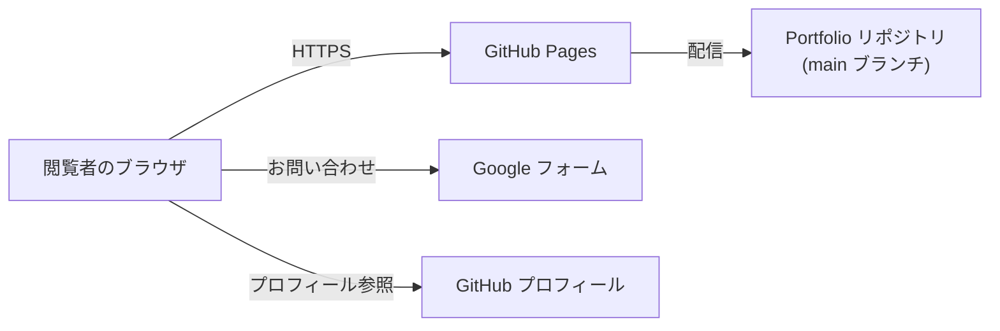
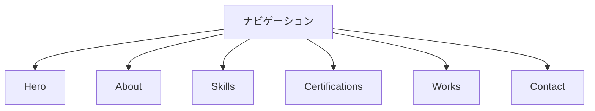

# 基本設計書 - Portfolio サイト

## 1. システム構成

### 1.1. 前提インフラ

- GitHub Pages（`main` ブランチを直接公開する構成。GitHub Actions は使用しない）

### 1.2. 構成図



## 2. 技術スタック

### 2.1. バージョン確定方針

- 外部ライブラリは最小限に留め、CDN 経由でバージョンを固定して読み込む

### 2.2. 採用ライブラリ

| ライブラリ | バージョン | 用途 | 配信元 |
| ---------- | ---------- | ---- | ------ |
| Font Awesome | 6.4.0 | アイコン表示 | cdnjs.cloudflare.com |
| Google Fonts (Inter) | 400 / 500 / 700 / 800 | 本文フォント | fonts.googleapis.com |

## 3. 機能設計

| 機能 | 実現方式 |
| ---- | -------- |
| ナビゲーション | アンカーリンク + CSS によるスムーズスクロール。`js/main.js` でモバイル用ハンバーガーメニューの開閉を制御する |
| Hero タイピングアニメーション | `js/main.js` が肩書き文字列配列を 1 文字ずつ `#typing-text` に追加・削除してループ再生する |
| About 年齢自動計算 | `js/main.js` が生年月日から現在日時との差分を計算し `#age-display` に描画する |
| Skills スキルバー | `js/data.js` のスキル配列（`name` / `years` / `level` / `category`）を `js/main.js` がカテゴリ別にグルーピングして `#skills-container` に描画する |
| Certifications 資格一覧 | `js/data.js` の資格配列を `js/main.js` が `#certifications-container` に描画する |
| Works 実績カード | `js/data.js` の実績配列（`title` / `desc_ja` / リンク等）を `js/main.js` が `#works-container` に描画する |
| Contact | 静的な Google フォーム URL・GitHub プロフィール URL へのリンク（サイト内フォーム処理は持たない） |
| 表示文言の切り出し | `js/i18n.js` に `data-i18n` 属性と対応する文言を保持する。`currentLang` は `'ja'` に固定しており、言語切替 UI・英語リソースは持たない |

## 4. データベース設計

### 4.1. 共通方針

該当なし。データベースを使用しない静的サイトであり、コンテンツデータは `js/data.js` に直接記述する。

### 4.2. テーブル定義

該当なし。

## 5. 画面設計

### 5.1. 画面一覧

| 画面 | 内容 |
| ---- | ---- |
| index.html | Hero / About / Skills / Certifications / Works / Contact の全セクションを含む単一ページ |

### 5.2. 画面遷移図

ページ遷移は発生しない。ナビゲーションのアンカーリンクにより同一ページ内の各セクションへスクロール移動する。



### 5.3. 主要画面の項目

| セクション | 主要項目 |
| ---------- | -------- |
| Hero | 氏名、タイピングアニメーションによる肩書き、キャッチコピー |
| About | 自己紹介文、年齢（自動計算）、職業、学歴、居住地、趣味、GitHub URL |
| Skills | カテゴリ別スキルバー（技術名 / 経験年数 / 習熟度） |
| Certifications | 取得資格の一覧 |
| Works | 実績タイトル、説明、リンク |
| Contact | Google フォームへのリンクボタン、GitHub アイコンリンク |

## 6. 外部インタフェース設計

| 連携先 | 用途 | 方式 |
| ------ | ---- | ---- |
| Google フォーム | お問い合わせ受付 | 静的リンク（サイト内フォーム送信処理は持たない） |
| GitHub | プロフィール・リポジトリ参照 | 静的リンク |
| Font Awesome CDN / Google Fonts CDN | アイコン・フォント配信 | `<link>` タグによる読み込み |

## 7. 非機能要件の実現方式

要件定義書「[6. 非機能要件](REQUIREMENTS.md#6-非機能要件)」の各項目に対応する。

| 要件定義書の項番 | 項目 | 実現方式 |
| ---------------- | ---- | -------- |
| 6.1 | 可用性 | GitHub Pages の可用性に委譲する |
| 6.2 | 性能 | 外部ライブラリを Font Awesome・Google Fonts のみに限定し、依存を最小化する |
| 6.3 | セキュリティ | 職務経歴書の実データは本リポジトリに一切含めない。`tools/skillsheet-builder/` に公開するのはダミーデータのみとする（詳細は [8. 職務経歴書の管理方式](#8-職務経歴書の管理方式)を参照） |
| 6.4 | バックアップ・リストア | 該当なし（ソースは GitHub リポジトリの履歴で管理） |
| 6.5 | 運用・保守 | CI/CD を用いず、`main` ブランチへのマージで GitHub Pages に反映する |
| 6.6 | コスト | GitHub Pages の無料枠内で運用する |
| 6.7 | 移植性・保守性 | フレームワーク非依存の Vanilla HTML/CSS/JavaScript 構成とする |

## 8. 職務経歴書の管理方式

Portfolio サイト本体（1〜7 章）とは独立した、個人の職務経歴書（スキルシート）運用に関する設計を記載する。

- 作業ディレクトリはローカル（例: `~/skillsheet/`）に置き、Portfolio リポジトリには含めない
- 履歴管理はリモートを持たないローカル git リポジトリで行う
- バックアップは Google ドライブへの退避で担保する
- PDF 生成はローカルの `build_pdf.py` 実行で行い、GitHub Actions 等の CI は使用しない
- ビルドスクリプトとテンプレートは、架空のダミーデータを同梱した形で Portfolio リポジトリの
  `tools/skillsheet-builder/` に公開する。実データは同梱しない
- 公開ツールのセットアップ手順・実行方法は [`tools/skillsheet-builder/README.md`](../tools/skillsheet-builder/README.md) を参照

## 9. ディレクトリ構成

```text
Portfolio/
├── index.html               # エントリーポイント
├── css/
│   ├── style.css            # メインスタイルシート
│   ├── variables.css        # CSS変数定義（色、フォント、サイズ）
│   ├── reset.css            # リセットCSS
│   └── components/          # コンポーネント別CSS
├── js/
│   ├── main.js               # メインロジック（UI操作、イベント）
│   ├── data.js                # コンテンツデータ（スキル、資格、実績）
│   └── i18n.js                 # 表示文言データ（日本語のみ）
├── assets/
│   ├── images/               # 画像ファイル
│   └── fonts/                  # フォントファイル
├── img/                       # サイト掲載用画像
├── tools/
│   └── skillsheet-builder/    # 職務経歴書ビルダー（ダミーデータ同梱、実データは非同梱）
└── docs/
    ├── REQUIREMENTS.md
    └── DESIGN.md
```
